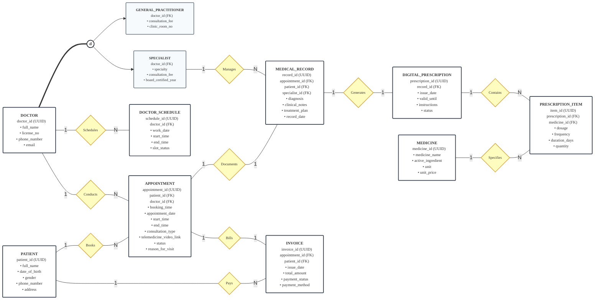

# Enhanced Entity-Relationship (EER) Conceptual Model Documentation
## Topic 05: Healthcare Clinic & Telemedicine Portal
**Course:** Database Systems (INT1313) — Semester 1, 2026–2027 | PTIT  
**Author (EER Design):** Nguyen Dang Tuan Minh (N25DCAT089 / @ndtuanminh-o)  
**Team:** G5 — Pingo  

---

## 1. Revision Overview & Quality Improvements

This revision directly addresses the critical feedback points regarding conceptual modeling rigor, notation consistency, and cross-phase alignment:

1. **Diamond Name => Relationship Semantics**:
   - In EER / Chen notation, every diamond strictly represents a **Relationship Type**.
   - **Fix redundant relationships:** Removed the duplicated `Owns` diamond between `PATIENT` and `INVOICE`. In healthcare billing workflows, an invoice is issued for an appointment (`Bills` 1:1) and settled by the patient (`Pays` 1:N). Having two parallel relationships (`Pays` and `Owns`) between the same entity pair was structurally redundant.
   - All 10 remaining diamonds now represent distinct, semantically unambiguous clinical and administrative relationships.

2. **Cardinality in Diagram => Standardized Notation**:
   - Eliminated the mix of Chen cardinality ratios (`1`, `N`) and UML/min..max intervals (`0..1`, `1..N`) on diagram edges.
   - The visual model strictly uses **Elmasri-Navathe Cardinality Ratios** (`1:1`, `1:N`) on relationship lines, coupled with single/double lines for participation.
   - Section 4 provides the full **Structural Constraints Matrix `(min, max)`** specifying exact lower and upper bounds for every participating entity.

3. **Cross-Phase Synchronization Anchors**:
   - **`DOCTOR_SCHEDULE`**: Explicitly preserves `work_date` (specific duty date) and `slot_status` (`Available`, `Booked`, `Blocked`). Phase 2 physical schema must retain these fields rather than reducing to recurring weekly day-of-week slots.
   - **`APPOINTMENT`**: Explicitly preserves `booking_time` (reservation timestamp) distinct from scheduled execution interval `[start_time, end_time]`.
   - **Clinical Encounter Chain**: Formalizes the clinical dependency `APPOINTMENT` (1:1) → `MEDICAL_RECORD` (1:1) → `DIGITAL_PRESCRIPTION` (1:N) → `PRESCRIPTION_ITEM`. A prescription is legally and clinically authorized through a diagnostic record, not bypassed directly from an appointment header.
   - **Physician Specialization**: Maintains the `DOCTOR` superclass with Total Specialization (`===`) and Disjoint Constraint (`(d)`), specializing into `GENERAL_PRACTITIONER` and `SPECIALIST` (retaining `board_certified_year`, `specialty`, and `consultation_fee`).

4. **Consultation Type & Telemedicine Support**:
   - Standardized attribute: `consultation_type` (`ENUM('In-Person', 'Telemedicine')`).
   - Integrated `telemedicine_video_link` (Nullable; mandatory when `consultation_type = 'Telemedicine'` upon moving to `In-Progress` per BR-05).

---

## 2. Mermaid Source Code (Conceptual EER Diagram)

The Mermaid diagram below defines the conceptual model adhering to the revised specifications:

---

## 3. Entity & Subclass Specifications

### 3.1. Physician Specialization Hierarchy
- **`DOCTOR` (Superclass Entity)**:
  - `doctor_id` (UUID, PK): Surrogate primary identifier.
  - `full_name` (VARCHAR(100)): Legal full name of licensed practitioner.
  - `license_no` (VARCHAR(30), UQ): Ministry of Health practicing license number.
  - `phone_number` (VARCHAR(15)): Official contact telephone number.
  - `email` (VARCHAR(100)): Professional clinic email.
- **Specialization Constraint `(d)` (Disjoint)**:
  - $\text{GENERAL\_PRACTITIONER} \cap \text{SPECIALIST} = \emptyset$.
  - A doctor cannot concurrently practice as both a General Practitioner and a Specialist in the system scope.
- **Total Specialization Constraint (`===`)**:
  - $\text{DOCTOR} = \text{GENERAL\_PRACTITIONER} \cup \text{SPECIALIST}$.
  - Every registered doctor must specialize as either a GP or a Specialist.
- **`GENERAL_PRACTITIONER` (Subclass)**:
  - `doctor_id` (UUID, PK/FK): References `DOCTOR(doctor_id)`.
  - `clinic_room_no` (VARCHAR(20)): Assigned outpatient consultation room.
  - `consultation_fee` (DECIMAL(10,2)): Base outpatient physical consultation charge.
- **`SPECIALIST` (Subclass)**:
  - `doctor_id` (UUID, PK/FK): References `DOCTOR(doctor_id)`.
  - `specialty` (VARCHAR(50)): Clinical specialty department (Cardiology, Dermatology, etc.).
  - `consultation_fee` (DECIMAL(10,2)): Specialist consultation rate.
  - `board_certified_year` (INT): Year medical board certification was awarded.

---

### 3.2. Rostering & Patient Encounter Entities
- **`DOCTOR_SCHEDULE`**:
  - `schedule_id` (UUID, PK): Surrogate identifier for duty shift.
  - `doctor_id` (UUID, FK): References `DOCTOR(doctor_id)`.
  - `work_date` (DATE): Calendar date of scheduled shift.
  - `start_time` / `end_time` (TIME): Shift operating hours (`end_time > start_time`).
  - `slot_status` (ENUM): Real-time shift state (`'Available'`, `'Booked'`, `'Blocked'`).
- **`PATIENT`**:
  - `patient_id` (UUID, PK): Surrogate patient identifier.
  - `full_name` (VARCHAR(100)): Full legal name.
  - `date_of_birth` (DATE): Birth date (`date_of_birth <= CURRENT_DATE`).
  - `gender` (ENUM('M', 'F', 'O')): Biological sex.
  - `phone_number` (VARCHAR(15), UQ): Primary contact phone number.
  - `address` (VARCHAR(255)): Residential address.
- **`APPOINTMENT`**:
  - `appointment_id` (UUID, PK): Surrogate reservation token.
  - `patient_id` (UUID, FK): References `PATIENT(patient_id)`.
  - `doctor_id` (UUID, FK): References `DOCTOR(doctor_id)`.
  - `booking_time` (DATETIME): Timestamp when reservation was created.
  - `appointment_date` (DATE): Scheduled consultation date.
  - `start_time` / `end_time` (TIME): Consultation time slot.
  - `consultation_type` (ENUM('In-Person', 'Telemedicine')): Care delivery modality.
  - `telemedicine_video_link` (TEXT, Nullable): Encrypted video call link (mandatory when `consultation_type = 'Telemedicine'` during `In-Progress`).
  - `status` (ENUM): `'Scheduled'`, `'In-Progress'`, `'Completed'`, `'Cancelled'`.
  - `reason_for_visit` (TEXT): Patient's chief complaint.

---

### 3.3. Clinical Documentation & Pharmacy Entities
- **`MEDICAL_RECORD`**:
  - `record_id` (UUID, PK): Clinical consultation encounter identifier.
  - `appointment_id` (UUID, FK, UQ): References `APPOINTMENT(appointment_id)`.
  - `patient_id` (UUID, FK): References `PATIENT(patient_id)`.
  - `specialist_id` (UUID, FK, Nullable): References `SPECIALIST(doctor_id)`.
  - `diagnosis` (TEXT): Formal clinical diagnostic finding (`NOT NULL`).
  - `clinical_notes` (TEXT): Examination anamnesis and observations.
  - `treatment_plan` (TEXT): Non-pharmacological plan and recommendations.
  - `record_date` (DATETIME): Clinical record sign-off timestamp.
- **`DIGITAL_PRESCRIPTION`**:
  - `prescription_id` (UUID, PK): Electronic prescription order identifier.
  - `record_id` (UUID, FK, UQ): References `MEDICAL_RECORD(record_id)`.
  - `issue_date` (DATETIME): Issuance timestamp.
  - `valid_until` (DATE): Expiration date.
  - `instructions` (TEXT): Patient administration directions.
  - `status` (ENUM): `'Draft'`, `'Issued'`, `'Dispensed'`, `'Cancelled'`.
- **`PRESCRIPTION_ITEM`**:
  - `item_id` (UUID, PK): Line item identifier.
  - `prescription_id` (UUID, FK): References `DIGITAL_PRESCRIPTION(prescription_id)`.
  - `medicine_id` (UUID, FK): References `MEDICINE(medicine_id)`.
  - `dosage` (VARCHAR(50)): Prescribed dosage (e.g., '500mg').
  - `frequency` (VARCHAR(50)): Frequency (e.g., 'Twice daily').
  - `duration_days` (INT): Duration in days (`duration_days > 0`).
  - `quantity` (INT): Total dispensed units (`quantity > 0`).
- **`MEDICINE`**:
  - `medicine_id` (UUID, PK): Pharmaceutical catalog code.
  - `medicine_name` (VARCHAR(100), UQ): Proprietary / generic drug name.
  - `active_ingredient` (VARCHAR(100)): Chemical active compound.
  - `unit` (VARCHAR(20)): Dispensing unit (tablet, bottle, ampoule).
  - `unit_price` (DECIMAL(10,2)): Unit price (`unit_price >= 0`).

---

### 3.4. Financial Billing Entity
- **`INVOICE`**:
  - `invoice_id` (UUID, PK): Financial invoice identifier.
  - `appointment_id` (UUID, FK, UQ): References `APPOINTMENT(appointment_id)`.
  - `patient_id` (UUID, FK): References `PATIENT(patient_id)`.
  - `issue_date` (DATETIME): Invoice generation timestamp.
  - `total_amount` (DECIMAL(10,2)): Consolidated amount (Consultation fee + Medication sum).
  - `payment_status` (ENUM): `'Unpaid'`, `'Paid'`, `'Refunded'`.
  - `payment_method` (ENUM): `'Cash'`, `'Credit Card'`, `'Insurance'`, `'Bank Transfer'`.

---

## 4. Formal Relationship & Structural Constraints Matrix (10 Diamonds)

This matrix formalizes both the **Cardinality Ratio** and the **Structural Constraints `(min, max)`** per Elmasri-Navathe conventions:

| # | Relationship Name | Entity 1 | Entity 2 | Cardinality Ratio | Structural Constraint Entity 1 | Structural Constraint Entity 2 | Participation Entity 1 / Entity 2 | Semantics & Business Meaning |
| :-: | :--- | :--- | :--- | :-: | :-: | :-: | :-: | :--- |
| **1** | **`Schedules`** | `DOCTOR` | `DOCTOR_SCHEDULE` | 1 : N | `(0, N)` | `(1, 1)` | Partial / Total | A doctor may register zero or many working shifts; each shift belongs strictly to one doctor. |
| **2** | **`Conducts`** | `DOCTOR` | `APPOINTMENT` | 1 : N | `(0, N)` | `(1, 1)` | Partial / Total | A doctor may conduct multiple appointments; each appointment is assigned to exactly one doctor. |
| **3** | **`Books`** | `PATIENT` | `APPOINTMENT` | 1 : N | `(0, N)` | `(1, 1)` | Partial / Total | A patient may book multiple appointments; each appointment is booked by exactly one patient. |
| **4** | **`Documents`** | `APPOINTMENT` | `MEDICAL_RECORD` | 1 : 1 | `(0, 1)` | `(1, 1)` | Partial / Total | An appointment produces at most one medical record upon completion; a record must belong to one appointment. |
| **5** | **`Manages`** | `SPECIALIST` | `MEDICAL_RECORD` | 1 : N | `(0, N)` | `(0, 1)` | Partial / Partial | A specialist may manage multiple specialized records; a general record may not require a specialist. |
| **6** | **`Generates`** | `MEDICAL_RECORD` | `DIGITAL_PRESCRIPTION` | 1 : 1 | `(0, 1)` | `(1, 1)` | Partial / Total | A medical record authorizes at most one prescription; a prescription must link to a diagnostic record. |
| **7** | **`Contains`** | `DIGITAL_PRESCRIPTION` | `PRESCRIPTION_ITEM` | 1 : N | `(1, N)` | `(1, 1)` | Total / Total | A valid prescription must contain at least one line item; each line item belongs to one prescription. |
| **8** | **`Specifies`** | `MEDICINE` | `PRESCRIPTION_ITEM` | 1 : N | `(0, N)` | `(1, 1)` | Partial / Total | A medicine formulary item may be specified in multiple prescription items; each line specifies one medicine. |
| **9** | **`Bills`** | `APPOINTMENT` | `INVOICE` | 1 : 1 | `(1, 1)` | `(1, 1)` | Total / Total | Each completed appointment generates exactly one invoice; an invoice strictly references one encounter. |
| **10**| **`Pays`** | `PATIENT` | `INVOICE` | 1 : N | `(0, N)` | `(1, 1)` | Partial / Total | A patient pays multiple clinic invoices; each invoice is billed to and settled by one patient. |

*(Note: Duplicate `Owns` relationship has been permanently removed).*

---

## 5. Directives for Phase 2 Synchronization (Handover Guide for Team)

To ensure 100% architectural consistency across the repository, the Phase 2 Physical Relational Schema team must map strictly from this EER specification:

1. **Retain Shift Scheduling Fields**:
   - `DOCTOR_SCHEDULE` in Phase 2 **must** include `work_date` (DATE) and `slot_status` (ENUM), enabling real-time appointment conflict checking (BR-01, BR-02). Do not replace with static recurring `day_of_week`.
2. **Retain Reservation Timestamp**:
   - `APPOINTMENT` **must** include `booking_time` (DATETIME) to preserve audit trails of when bookings were submitted.
3. **Preserve Clinical Diagnosis Chain**:
   - Do not bypass `MEDICAL_RECORD`. In physical mapping, `DIGITAL_PRESCRIPTION` references `MEDICAL_RECORD(record_id)` with a `UNIQUE` foreign key (enforcing 1:0..1).
4. **Physician Subclass Attributes**:
   - `SPECIALIST` must retain `board_certified_year` (INT) and use standardized attribute `consultation_fee`.
5. **Medicine Formulary Integrity**:
   - Ensure `MEDICINE` preserves `active_ingredient`, `unit`, and `unit_price` in addition to warehouse stock tracking attributes (`stock_quantity`, `reorder_level`).
