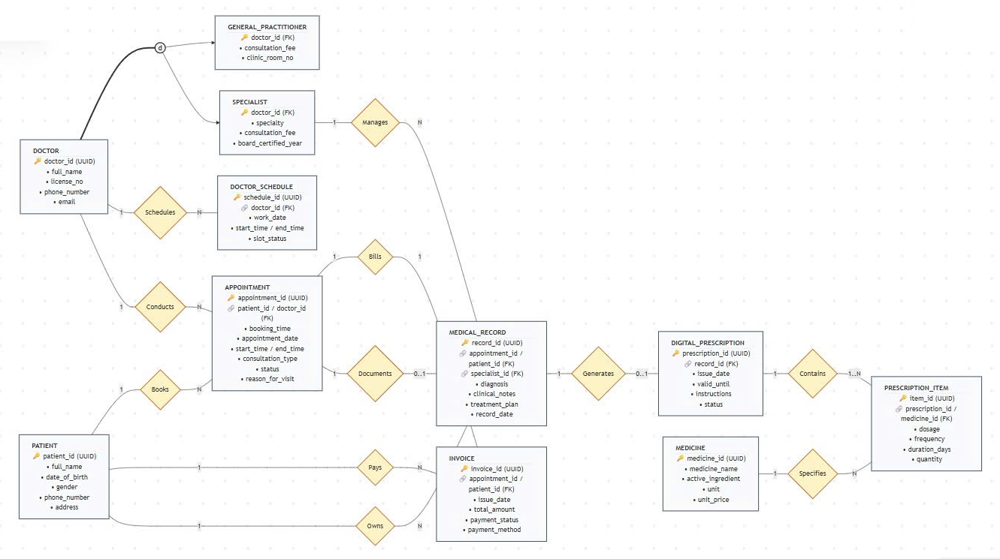
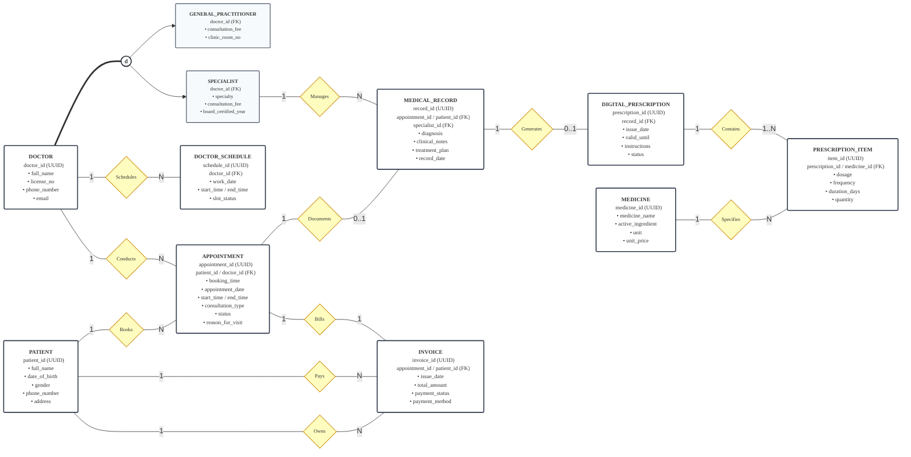
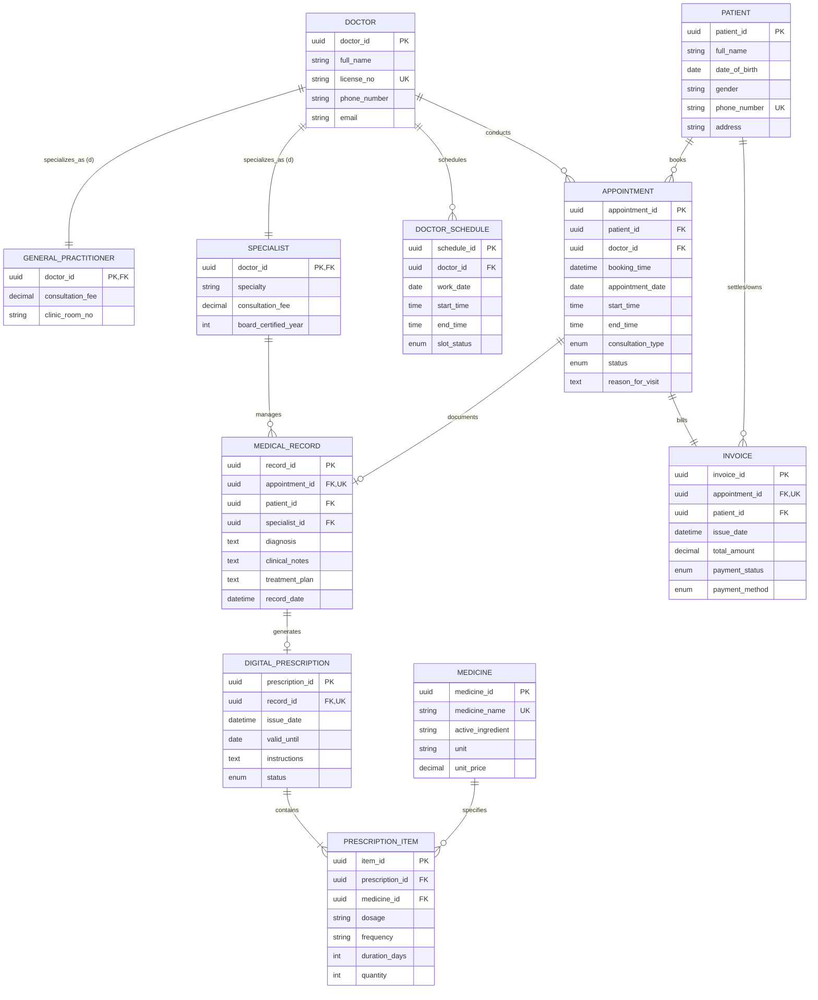

# Enhanced Entity-Relationship (EER) Conceptual Design Report
## Topic 05: Healthcare Clinic & Telemedicine Portal
### Posts and Telecommunications Institute of Technology (PTIT) - Faculty of Information Technology
**Course:** Database Systems (INT1313) | **Class:** INT1313_02 | **Project Team:** Pingo

---

## 1. System Overview & Architectural Objectives

The **Enhanced Entity-Relationship (EER)** model for the **Healthcare Clinic & Telemedicine Portal** is engineered in strict conformance with the academic framework established by *Elmasri & Navathe (Fundamentals of Database Systems, 7th Edition, Chapter 4)* and international software engineering standards (*ISO/IEC/IEEE 29148:2018*).

Modern medical facilities are transitioning toward hybrid healthcare delivery models. The core architectural objective of this database system is to **unify physical on-premise outpatient clinic visits and remote video-based telemedicine consultations into a single, cohesive, high-integrity relational database**. The system eliminates operational fragmentation and enforces an atomic, state-driven workflow:

$$\text{Appointment Scheduling} \longrightarrow \text{Clinical Consultation} \longrightarrow \text{Medical Diagnosis} \longrightarrow \text{Digital Prescription} \longrightarrow \text{Automated Drug Inventory Deduction} \longrightarrow \text{Consolidated Invoicing}$$

---

## 2. Visual Diagram (High-Resolution Diagram)


*Figure 2.1: Formal Enhanced Entity-Relationship (EER) Diagram - Topic 05: Healthcare Clinic & Telemedicine Portal*

---

## 3. Executable Mermaid Source Code

The following executable Mermaid specifications can be directly rendered in any modern Markdown viewer supporting Mermaid (GitHub, GitLab, VS Code, Notion, Obsidian, or Mermaid Live Editor).

### 3.1. EER Conceptual Graph (Elmasri-Navathe / Chen Extended Notation)

This specification captures the exact visual layout of the original conceptual schema, including entity boxes, primary/foreign key designations, relationship diamonds, and the specialization hierarchy circle `(d)` with double-line total participation `===`:



---

### 3.2. Native Mermaid Relational ER Diagram

This schema uses native Mermaid `erDiagram` syntax with Crow's Foot cardinality indicators, directly compatible with relational database modeling engines:



---

## 4. Formal Entity Specifications

### 4.1. Medical Staff Specialization Hierarchy

The database employs formal Enhanced Entity-Relationship (EER) modeling to structure medical practitioner specialization:

```
                  ┌──────────────────────┐
                  │    DOCTOR (Super)    │
                  └──────────┬───────────┘
                             │
                            === (Total Participation)
                             │
                            (d) (Disjointness Constraint)
                             │
               ┌─────────────┴─────────────┐
               ▼                           ▼
  ┌─────────────────────────┐ ┌─────────────────────────┐
  │  GENERAL_PRACTITIONER   │ │       SPECIALIST        │
  │  (On-premise Outpatient)│ │  (Domain Care & Telemed)│
  └─────────────────────────┘ └─────────────────────────┘
```

#### Mathematical Formulation & Integrity Constraints:
1. **Superclass (`DOCTOR`)**:
   - Models common baseline attributes: `doctor_id` (Primary Key, UUID), `full_name` (Legal practitioner name), `license_no` (Ministry of Health registration number, Unique Key), `phone_number`, and `email`.
2. **Disjointness Constraint ($\mathbf{d}$)**:
   $$\text{GENERAL\_PRACTITIONER} \cap \text{SPECIALIST} = \emptyset$$
   - A practitioner record cannot belong simultaneously to both specialized categories. A doctor must practice either as a General Practitioner or as a Board-Certified Specialist within the system scope.
3. **Total Specialization / Completeness Constraint ($\mathbf{===}$)**:
   $$\text{DOCTOR} = \text{GENERAL\_PRACTITIONER} \cup \text{SPECIALIST}$$
   - Every registered `DOCTOR` entity instance must map to exactly one subclass. No abstract or untyped doctor record can exist in the system.
4. **Subclass Specializations**:
   - **`GENERAL_PRACTITIONER`**: Handles primary physical consultations at the outpatient clinic. Inherits all `DOCTOR` attributes and adds domain-specific attributes: `clinic_room_no` (e.g., *'Room 102'*), `consultation_fee` (Standard clinic fee).
   - **`SPECIALIST`**: Manages complex pathologies and remote telemedicine consultations. Inherits all `DOCTOR` attributes and adds: `specialty` (Clinical domain: *Cardiology, Dermatology, Neurology, etc.*), `consultation_fee` (Specialist rate), `board_certified_year` (Year of post-graduate certification).

---

### 4.2. Scheduling & Clinical Coordination Entities

- **`DOCTOR_SCHEDULE` (Physician Duty Roster)**:
  - Manages discrete shift assignments and availability windows for medical staff.
  - **Attributes**: `schedule_id` (PK, UUID), `doctor_id` (FK referencing `DOCTOR`), `work_date` (Date), `start_time` (Time), `end_time` (Time), `slot_status` (Enum: `Available`, `Booked`, `Blocked`).
  - **Integrity Rule**: Enforces temporal sanity $end\_time > start\_time$.
- **`APPOINTMENT` (Central Consultation Coordinator)**:
  - Central coordinating entity synchronizing patients, attending physicians, and clinical workflows across both care modalities.
  - **Attributes**: `appointment_id` (PK, UUID), `patient_id` (FK referencing `PATIENT`), `doctor_id` (FK referencing `DOCTOR`), `booking_time` (Timestamp recorded), `appointment_date` (Scheduled session date), `start_time`, `end_time`, `consultation_type` (Enum: `In-Person`, `Telemedicine`), `status` (Enum: `Scheduled`, `In-Progress`, `Completed`, `Cancelled`), `reason_for_visit` (Chief clinical complaint).

---

### 4.3. Clinical Encounter & Digital Pharmacy Entities

- **`PATIENT` (Demographic Master)**:
  - Repository of registered patient identities and clinical demographics.
  - **Attributes**: `patient_id` (PK, UUID), `full_name`, `date_of_birth` (Constraint: $\le \text{CURRENT\_DATE}$), `gender` (`M`, `F`, `O`), `phone_number` (Unique contact token), `address`.
- **`MEDICAL_RECORD` (Diagnostic Encounter Ledger)**:
  - Official medical documentation generated upon consultation completion.
  - **Attributes**: `record_id` (PK, UUID), `appointment_id` (FK, Unique Key - guarantees at most one record per appointment encounter), `patient_id` (FK), `specialist_id` (FK, Nullable - attending consulting specialist), `diagnosis` (Mandatory formal ICD conclusion), `clinical_notes`, `treatment_plan`, `record_date`.
- **`DIGITAL_PRESCRIPTION` (Pharmaceutical Order Authorization)**:
  - Electronic prescription issued directly from an authorized clinical consultation.
  - **Attributes**: `prescription_id` (PK, UUID), `record_id` (FK, Unique Key - enforces $1:0..1$ relationship with `MEDICAL_RECORD`), `issue_date`, `valid_until` (Expiration threshold), `instructions`, `status` (Enum: `Draft`, `Issued`, `Dispensed`, `Cancelled`).
- **`PRESCRIPTION_ITEM` (Prescribed Medication Line Item)**:
  - Associative entity normalizing the many-to-many ($M:N$) relationship between `DIGITAL_PRESCRIPTION` and `MEDICINE`.
  - **Attributes**: `item_id` (PK, UUID), `prescription_id` (FK), `medicine_id` (FK), `dosage` (e.g., *'500mg'*), `frequency` (e.g., *'Twice daily after meals'*), `duration_days` (Constraint: $> 0$), `quantity` (Units dispensed, Constraint: $> 0$).
- **`MEDICINE` (Pharmacy Inventory & Formulary)**:
  - Master catalog of pharmaceutical drugs managed by the clinic pharmacy.
  - **Attributes**: `medicine_id` (PK, UUID), `medicine_name` (Unique trade name), `active_ingredient` (Pharmacological compound), `unit` (*Tablet, Bottle, Vial*), `unit_price` (Constraint: $\ge 0$).

---

### 4.4. Financial Ledger Entity

- **`INVOICE` (Consolidated Fiscal Billing Ledger)**:
  - Unified financial bill accounting for clinical encounter professional fees and dispensed pharmacy medications.
  - **Attributes**: `invoice_id` (PK, UUID), `appointment_id` (FK, Unique Key - enforces $1:1$ encounter settlement), `patient_id` (FK), `issue_date`, `total_amount` (Consultation fee + Sum of medication line totals), `payment_status` (Enum: `Unpaid`, `Paid`, `Refunded`), `payment_method` (Enum: `Cash`, `Credit Card`, `Insurance`, `Bank Transfer`).

---

## 5. Relationship Matrix & Cardinality Constraints

The table below provides a comprehensive semantic breakdown of all ten relationships depicted in the EER diagram:

| Relationship Name | Participating Entities | Cardinality Ratio | Participation Constraint | Clinical & Business Semantics |
| :--- | :--- | :---: | :---: | :--- |
| **Schedules** | `DOCTOR` $\longleftrightarrow$ `DOCTOR_SCHEDULE` | $1 : N$ | Total on Schedule side | A doctor registers multiple working shifts; each shift belongs strictly to exactly one doctor. |
| **Conducts** | `DOCTOR` $\longleftrightarrow$ `APPOINTMENT` | $1 : N$ | Partial | A physician conducts multiple clinical appointments across physical or virtual channels. |
| **Books** | `PATIENT` $\longleftrightarrow$ `APPOINTMENT` | $1 : N$ | Partial | A registered patient may schedule and participate in multiple appointments over time. |
| **Documents** | `APPOINTMENT` $\longleftrightarrow$ `MEDICAL_RECORD` | $1 : 0..1$ | Partial | A concluded consultation yields at most one official clinical diagnostic record. |
| **Manages** | `SPECIALIST` $\longleftrightarrow$ `MEDICAL_RECORD` | $1 : N$ | Partial | An attending specialist physician manages and oversees multiple specialized patient records. |
| **Generates** | `MEDICAL_RECORD` $\longleftrightarrow$ `DIGITAL_PRESCRIPTION` | $1 : 0..1$ | Partial | A medical record may authorize at most one electronic prescription. |
| **Contains** | `DIGITAL_PRESCRIPTION` $\longleftrightarrow$ `PRESCRIPTION_ITEM` | $1 : 1..N$ | Total on Prescription side | A valid issued prescription must specify at least one prescribed medication line item. |
| **Specifies** | `MEDICINE` $\longleftrightarrow$ `PRESCRIPTION_ITEM` | $1 : N$ | Partial | A dispensary drug item may be referenced across multiple prescription orders. |
| **Bills** | `APPOINTMENT` $\longleftrightarrow$ `INVOICE` | $1 : 1$ | Total on Invoice side | Each completed clinical appointment generates exactly one consolidated fiscal invoice. |
| **Pays / Owns** | `PATIENT` $\longleftrightarrow$ `INVOICE` | $1 : N$ | Partial | The patient is the designated legal owner and payer responsible for invoice settlement. |

---

## 6. Business Rules Enforced by the EER Model (BR-01 to BR-12)

The conceptual schema enforces twelve foundational business and data integrity rules:

- **BR-01 (No Overlap Booking)**: A patient or physician cannot be scheduled for two concurrent appointments with overlapping time intervals $[start\_time, end\_time]$.
- **BR-02 (Doctor Shift Alignment)**: Appointments must strictly fall within active duty shift windows registered in `DOCTOR_SCHEDULE`.
- **BR-03 (Finite State Transitions)**: Appointment lifecycle transitions strictly forward: $\text{Scheduled} \rightarrow \text{In-Progress} \rightarrow \text{Completed}$, or $\text{Scheduled} \rightarrow \text{Cancelled}$.
- **BR-04 (Doctor Role Partitioning)**: A physician must be categorized as either a General Practitioner or a Specialist, enforced via EER Disjoint ($d$) and Total ($=== $) specialization.
- **BR-05 (Telemedicine Verification)**: When `consultation_type = 'Telemedicine'`, a valid virtual encrypted room link must be provisioned prior to entering the `In-Progress` state.
- **BR-06 (Diagnostic Integrity)**: Medical records require an active patient, consulting doctor, completed appointment, and a non-null formal clinical diagnosis (`diagnosis NOT NULL`).
- **BR-07 (Prescription Singularity)**: At most one electronic prescription is generated per completed clinical encounter ($1:0..1$ relationship via Unique Key constraint).
- **BR-08 (Medication Item Validity)**: Prescribed items must specify active medications with strictly positive quantities ($quantity > 0$) and structured dosage regimens.
- **BR-09 (Automated Inventory Decrement)**: Prescribing expired medications is blocked. Updating a prescription to `Issued` atomically decrements physical stock in `MEDICINE`.
- **BR-10 (Prescription Immutability)**: Once transitioned to `Issued`, digital prescriptions and their line items become permanently read-only to preserve legal auditability.
- **BR-11 (Single Consolidated Invoice)**: Exactly one invoice is issued per appointment ($1:1$). $\text{Total Amount} = \text{Consultation Fee} + \sum(\text{Medication Cost})$.
- **BR-12 (Fiscal Settlement)**: Cumulative payments cannot exceed invoice balances; invoices atomically update to `Paid` upon complete settlement.

---

## 7. Transformation to Relational Model (Mapping Principles)

The conceptual EER schema is mapped into eleven normalized relational tables using the standard 7-step Relational Mapping Algorithm (*Elmasri & Navathe*):

1. **Strong Entity Relations**:
   - `DOCTOR(doctor_id [PK], full_name, license_no [UQ], phone_number, email)`
   - `PATIENT(patient_id [PK], full_name, date_of_birth, gender, phone_number [UQ], address)`
   - `MEDICINE(medicine_id [PK], medicine_name [UQ], active_ingredient, unit, unit_price)`
2. **Specialization Mapping (Option 8.4a - 1:1 Identity Inheritance)**:
   - `GENERAL_PRACTITIONER(doctor_id [PK, FK to DOCTOR], clinic_room_no, consultation_fee)`
   - `SPECIALIST(doctor_id [PK, FK to DOCTOR], specialty, consultation_fee, board_certified_year)`
3. **Weak / Dependent Relation Mapping**:
   - `DOCTOR_SCHEDULE(schedule_id [PK], doctor_id [FK to DOCTOR], work_date, start_time, end_time, slot_status)`
4. **Binary 1:1 and 1:N Relationship Mapping**:
   - `APPOINTMENT(appointment_id [PK], patient_id [FK], doctor_id [FK], booking_time, appointment_date, start_time, end_time, consultation_type, status, reason_for_visit)`
   - `MEDICAL_RECORD(record_id [PK], appointment_id [FK, UQ], patient_id [FK], specialist_id [FK, Nullable], diagnosis, clinical_notes, treatment_plan, record_date)`
   - `DIGITAL_PRESCRIPTION(prescription_id [PK], record_id [FK, UQ], issue_date, valid_until, instructions, status)`
   - `INVOICE(invoice_id [PK], appointment_id [FK, UQ], patient_id [FK], issue_date, total_amount, payment_status, payment_method)`
5. **Associative M:N Relationship Mapping**:
   - `PRESCRIPTION_ITEM(item_id [PK], prescription_id [FK], medicine_id [FK], dosage, frequency, duration_days, quantity)`
