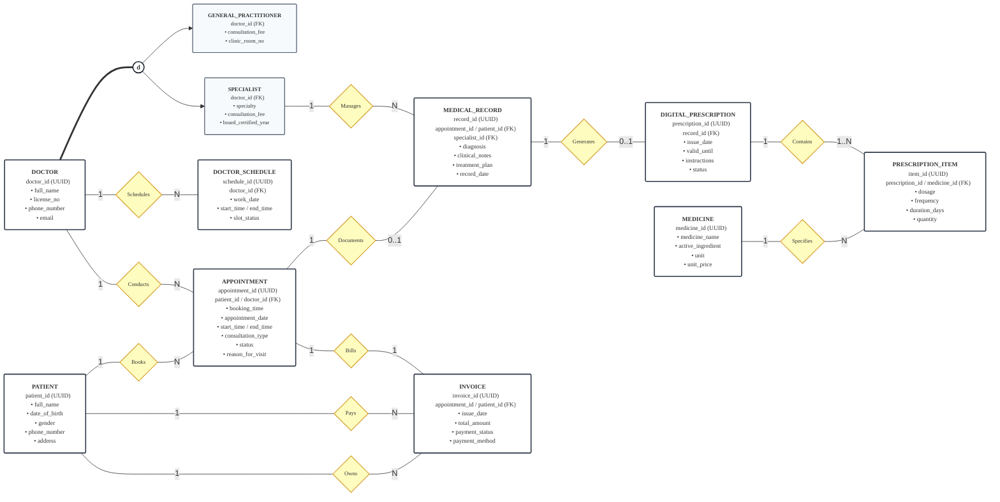

[EER_Diagram_EN.md](https://github.com/user-attachments/files/32011717/EER_Diagram_EN.md)
# Enhanced Entity-Relationship (EER) Conceptual Model Documentation
## Dedicated Analysis of: `er_diagram_cropped.png`
### Topic 05: Healthcare Clinic & Telemedicine Portal | Database Systems (INT1313) - PTIT

---

## 1. Visual Schema Diagram

This document is dedicated exclusively to the comprehensive analysis of the conceptual components presented in the diagram below:

*Figure: Enhanced Entity-Relationship (EER) Conceptual Diagram - Topic 05*

---

## 2. Mermaid Source Code (Exact Reproduction)

The following Mermaid code reproduces 100% of the entities, key attributes, relationship diamonds, specialization circle `(d)`, and cardinality ratios depicted in `er_diagram_cropped.png`:

---

## 3. Entity & Attribute Specifications (From the Diagram)

The conceptual schema contains 9 principal entity boxes and 2 specialization subclasses:

### 3.1. Physician Specialization Hierarchy
- **`DOCTOR` (Superclass)**:
  - `doctor_id` (UUID) - Primary Key (PK)
  - `full_name`: Legal practitioner name
  - `license_no`: Official medical practitioner license number
  - `phone_number`: Primary telephone number
  - `email`: Professional email address
- **Specialization Circle `(d)` (Disjoint Constraint)**:
  - `GENERAL_PRACTITIONER` ∩ `SPECIALIST` = ∅.
  - A doctor cannot simultaneously practice as both a General Practitioner and a Specialist within the same system scope.
- **Double-Line Connection `===` (Total Specialization)**:
  - `DOCTOR` = `GENERAL_PRACTITIONER` ∪ `SPECIALIST`.
  - Every registered doctor must belong to either `GENERAL_PRACTITIONER` or `SPECIALIST`.
- **`GENERAL_PRACTITIONER` (Subclass)**:
  - `doctor_id` (FK): Inherited from `DOCTOR`
  - `clinic_room_no`: Assigned outpatient consultation room number
  - `consultation_fee`: Standard physical clinic consultation fee
- **`SPECIALIST` (Subclass)**:
  - `doctor_id` (FK): Inherited from `DOCTOR`
  - `specialty`: Clinical medical specialty (Cardiology, Dermatology, etc.)
  - `consultation_fee`: Specialized clinical / telemedicine consultation fee
  - `board_certified_year`: Year of post-graduate board certification

---

### 3.2. Rostering & Encounter Coordination
- **`DOCTOR_SCHEDULE`**:
  - `schedule_id` (UUID) - Primary Key (PK)
  - `doctor_id` (FK): Foreign key referencing attending physician
  - `work_date`: Duty calendar date
  - `start_time / end_time`: Active shift time interval
  - `slot_status`: Booking status (Available, Booked, Blocked)
- **`PATIENT`**:
  - `patient_id` (UUID) - Primary Key (PK)
  - `full_name`: Full legal name
  - `date_of_birth`: Birth date
  - `gender`: Clinical gender
  - `phone_number`: Contact phone number
  - `address`: Residential address
- **`APPOINTMENT`**:
  - `appointment_id` (UUID) - Primary Key (PK)
  - `patient_id / doctor_id` (FK): Foreign keys linking patient and physician
  - `booking_time`: Reservation timestamp
  - `appointment_date`: Scheduled encounter date
  - `start_time / end_time`: Consultation time slot
  - `consultation_type`: Delivery modality (In-Person or Telemedicine)
  - `status`: Lifecycle state (Scheduled, In-Progress, Completed, Cancelled)
  - `reason_for_visit`: Chief clinical complaint

---

### 3.3. Clinical Documentation & Pharmacy Formulary
- **`MEDICAL_RECORD`**:
  - `record_id` (UUID) - Primary Key (PK)
  - `appointment_id / patient_id` (FK): Foreign keys referencing appointment and patient
  - `specialist_id` (FK): Attending specialist consulting physician
  - `diagnosis`: Formal diagnostic conclusion
  - `clinical_notes`: Clinical observations
  - `treatment_plan`: Therapeutic management plan
  - `record_date`: Record completion timestamp
- **`DIGITAL_PRESCRIPTION`**:
  - `prescription_id` (UUID) - Primary Key (PK)
  - `record_id` (FK): Link to clinical medical record
  - `issue_date`: Date issued
  - `valid_until`: Prescription expiration date
  - `instructions`: Patient administration directions
  - `status`: Prescription state (Draft, Issued, Dispensed, Cancelled)
- **`PRESCRIPTION_ITEM`**:
  - `item_id` (UUID) - Primary Key (PK)
  - `prescription_id / medicine_id` (FK): Links to prescription order and drug formulary
  - `dosage`: Prescribed dosage (e.g., '500mg')
  - `frequency`: Dosage frequency (e.g., 'Twice daily')
  - `duration_days`: Treatment length in days
  - `quantity`: Total dispensed quantity
- **`MEDICINE`**:
  - `medicine_id` (UUID) - Primary Key (PK)
  - `medicine_name`: Proprietary / generic drug name
  - `active_ingredient`: Active pharmaceutical compound
  - `unit`: Dispensing unit (tablet, bottle, vial)
  - `unit_price`: Unit retail price

---

### 3.4. Financial Billing
- **`INVOICE`**:
  - `invoice_id` (UUID) - Primary Key (PK)
  - `appointment_id / patient_id` (FK): Links to completed encounter and patient payer
  - `issue_date`: Billing date
  - `total_amount`: Total charges (Consultation fee + Medication charges)
  - `payment_status`: Settlement state (Unpaid, Paid, Refunded)
  - `payment_method`: Payment processing method (Cash, Card, Insurance, Transfer)

---

## 4. Relationship Matrix (11 Diamonds Breakdown)

Every relationship shown in `er_diagram_cropped.png` is documented below with its exact cardinality ratio:

| # | Diamond Name | Connected Entities | Cardinality in Image | Semantics & Business Meaning |
| :-: | :--- | :--- | :-: | :--- |
| **1** | **`Schedules`** | `DOCTOR` --- `DOCTOR_SCHEDULE` | 1 : N | 1 Doctor registers N working shifts. |
| **2** | **`Conducts`** | `DOCTOR` --- `APPOINTMENT` | 1 : N | 1 Doctor conducts N clinical appointments. |
| **3** | **`Books`** | `PATIENT` --- `APPOINTMENT` | 1 : N | 1 Patient books N scheduled appointments. |
| **4** | **`Documents`** | `APPOINTMENT` --- `MEDICAL_RECORD` | 1 : 0..1 | 1 Appointment generates at most 100..1 diagnostic medical record. |
| **5** | **`Manages`** | `SPECIALIST` --- `MEDICAL_RECORD` | 1 : N | 1 Specialist manages / oversees N medical records. |
| **6** | **`Generates`** | `MEDICAL_RECORD` --- `DIGITAL_PRESCRIPTION` | 1 : 0..1 | 1 Medical record authorizes at most 100..1 digital prescription. |
| **7** | **`Contains`** | `DIGITAL_PRESCRIPTION` --- `PRESCRIPTION_ITEM` | 1 : 1..N | 1 Digital prescription contains at least 111..N line items. |
| **8** | **`Specifies`** | `MEDICINE` --- `PRESCRIPTION_ITEM` | 1 : N | 1 Medicine catalog item is specified across N prescription lines. |
| **9** | **`Bills`** | `APPOINTMENT` --- `INVOICE` | 1 : 1 | 1 Appointment generates exactly 111 consolidated invoice. |
| **10**| **`Pays`** | `PATIENT` --- `INVOICE` | 1 : N | 1 Patient pays N clinic invoices. |
| **11**| **`Owns`** | `PATIENT` --- `INVOICE` | 1 : N | 1 Patient is the legal account owner of N invoices. |

---

## 5. Summary

The diagram `er_diagram_cropped.png` defines the complete conceptual EER model. It formalizes all medical entities, physician specialization rules, and healthcare encounter workflows without requiring downstream relational transformation details.
