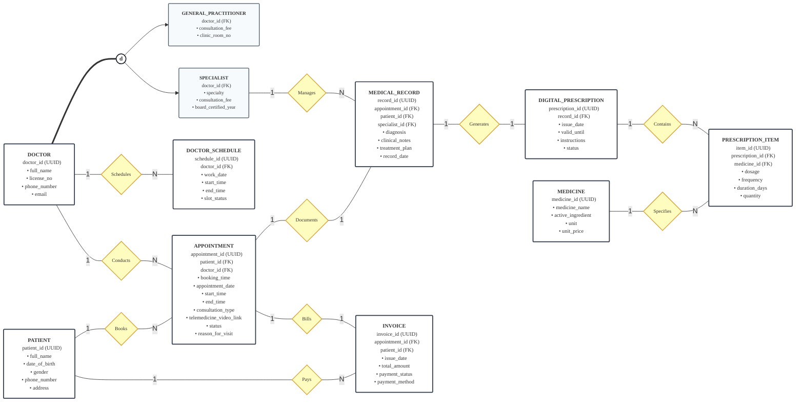

  <strong>🌐 Language / Ngôn ngữ:</strong>
  <a href="EER_Diagram_EN.md"><b>🇬🇧 English</b></a> |
  <a href="EER_Diagram_VI.md"><b>🇻🇳 Tiếng Việt</b></a>

# Tài liệu Thiết kế Mô hình Quan niệm Thực thể Mở rộng (EER)
## Đề tài 05: Phòng khám Y tế & Cổng thông tin Khám bệnh từ xa
**Môn học:** Hệ cơ sở dữ liệu (INT1313) — Học kỳ 1, 2026–2027 | Học viện Công nghệ Bưu chính Viễn thông (PTIT)  
**Tác giả thiết kế EER:** Nguyễn Đăng Tuấn Minh (N25DCAT089 / @ndtuanminh-o)  
**Nhóm:** G5 — Pingo  

---

## 1. Sơ đồ EER Quan niệm (Đặc tả Mermaid)

Sơ đồ Mermaid dưới đây biểu diễn đầy đủ mô hình thực thể mối kết hợp mở rộng (EER) chuẩn hóa:

---

## 2. Đặc tả Thực thể & Lớp chuyên biệt hóa

### 2.1. Phân cấp Chuyên biệt hóa Bác sĩ
- **`DOCTOR` (Thực thể cha - Superclass)**:
  - `doctor_id` (UUID, PK): Khóa chính định danh bác sĩ.
  - `full_name` (VARCHAR(100)): Họ và tên đầy đủ của bác sĩ.
  - `license_no` (VARCHAR(30), UQ): Số chứng chỉ hành nghề y tế (duy nhất).
  - `phone_number` (VARCHAR(15)): Số điện thoại liên hệ chính thức.
  - `email` (VARCHAR(100)): Email công vụ tại bệnh viện/phòng khám.
- **Ràng buộc rời nhau `(d)` (Disjoint Constraint)**:
  - `GENERAL_PRACTITIONER` ∩ `SPECIALIST` = ∅.
  - Một bác sĩ không thể vừa là Bác sĩ đa khoa vừa là Bác sĩ chuyên khoa trong cùng phạm vi hệ thống.
- **Ràng buộc toàn phần (`===`) (Total Specialization)**:
  - `DOCTOR` = `GENERAL_PRACTITIONER` ∪ `SPECIALIST`.
  - Mọi bác sĩ đăng ký trong hệ thống bắt buộc phải thuộc một trong hai chuyên khoa này.
- **`GENERAL_PRACTITIONER` (Lớp con - Bác sĩ đa khoa)**:
  - `doctor_id` (UUID, PK/FK): Tham chiếu đến `DOCTOR(doctor_id)`.
  - `clinic_room_no` (VARCHAR(20)): Phòng khám bệnh trực tiếp được phân công.
  - `consultation_fee` (DECIMAL(10,2)): Giá khám trực tiếp tiêu chuẩn.
- **`SPECIALIST` (Lớp con - Bác sĩ chuyên khoa)**:
  - `doctor_id` (UUID, PK/FK): Tham chiếu đến `DOCTOR(doctor_id)`.
  - `specialty` (VARCHAR(50)): Chuyên khoa lâm sàng (Tim mạch, Da liễu, Thần kinh, v.v.).
  - `consultation_fee` (DECIMAL(10,2)): Giá khám chuyên khoa / tư vấn từ xa.
  - `board_certified_year` (INT): Năm nhận chứng chỉ chuyên khoa.

---

### 2.2. Lịch trực & Quản lý Cuộc hẹn
- **`DOCTOR_SCHEDULE` (Lịch ca trực)**:
  - `schedule_id` (UUID, PK): Khóa chính định danh ca trực.
  - `doctor_id` (UUID, FK): Tham chiếu bác sĩ phụ trách.
  - `work_date` (DATE): Ngày diễn ra ca trực cụ thể.
  - `start_time` / `end_time` (TIME): Khung giờ bắt đầu và kết thúc ca trực.
  - `slot_status` (ENUM): Trạng thái ca trực (`'Available'`, `'Booked'`, `'Blocked'`).
- **`PATIENT` (Hồ sơ Bệnh nhân)**:
  - `patient_id` (UUID, PK): Khóa chính định danh bệnh nhân.
  - `full_name` (VARCHAR(100)): Họ và tên bệnh nhân.
  - `date_of_birth` (DATE): Ngày tháng năm sinh.
  - `gender` (ENUM('M', 'F', 'O')): Giới tính sinh học.
  - `phone_number` (VARCHAR(15), UQ): Số điện thoại liên lạc chính (duy nhất).
  - `address` (VARCHAR(255)): Địa chỉ cư trú / giao thuốc.
- **`APPOINTMENT` (Lịch hẹn khám bệnh)**:
  - `appointment_id` (UUID, PK): Mã số cuộc hẹn duy nhất.
  - `patient_id` (UUID, FK): Bệnh nhân đặt lịch.
  - `doctor_id` (UUID, FK): Bác sĩ phụ trách khám.
  - `booking_time` (DATETIME): Thời điểm bệnh nhân gửi yêu cầu đặt lịch.
  - `appointment_date` (DATE): Ngày diễn ra cuộc hẹn.
  - `start_time` / `end_time` (TIME): Khung thời gian khám.
  - `consultation_type` (ENUM('In-Person', 'Telemedicine')): Hình thức khám (Trực tiếp hoặc Từ xa).
  - `telemedicine_video_link` (TEXT): Đường dẫn phòng họp video mã hóa (bắt buộc khi khám Telemedicine ở trạng thái `In-Progress`).
  - `status` (ENUM): Trạng thái (`'Scheduled'`, `'In-Progress'`, `'Completed'`, `'Cancelled'`).
  - `reason_for_visit` (TEXT): Lý do khám hoặc triệu chứng ban đầu.

---

### 2.3. Hồ sơ Bệnh án & Quản lý Đơn thuốc
- **`MEDICAL_RECORD` (Hồ sơ Bệnh án)**:
  - `record_id` (UUID, PK): Mã số hồ sơ chẩn đoán lâm sàng.
  - `appointment_id` (UUID, FK, UQ): Cuộc hẹn tương ứng (quan hệ 1:0..1 duy nhất).
  - `patient_id` (UUID, FK): Bệnh nhân được chẩn đoán.
  - `specialist_id` (UUID, FK, Nullable): Bác sĩ chuyên khoa phụ trách chẩn đoán (nếu có).
  - `diagnosis` (TEXT): Kết luận chẩn đoán bệnh chính thức (bắt buộc `NOT NULL`).
  - `clinical_notes` (TEXT): Ghi chú diễn tiến khám và tiền sử.
  - `treatment_plan` (TEXT): Phác đồ điều trị và hướng dẫn chăm sóc.
  - `record_date` (DATETIME): Thời điểm bác sĩ ký xác nhận hồ sơ.
- **`DIGITAL_PRESCRIPTION` (Đơn thuốc Điện tử)**:
  - `prescription_id` (UUID, PK): Mã đơn thuốc điện tử.
  - `record_id` (UUID, FK, UQ): Tham chiếu hồ sơ bệnh án chỉ định đơn thuốc (1:0..1).
  - `issue_date` (DATETIME): Thời điểm cấp đơn thuốc.
  - `valid_until` (DATE): Hạn hiệu lực của đơn thuốc.
  - `instructions` (TEXT): Lời dặn uống thuốc cho bệnh nhân.
  - `status` (ENUM): Trạng thái (`'Draft'`, `'Issued'`, `'Dispensed'`, `'Cancelled'`).
- **`PRESCRIPTION_ITEM` (Chi tiết Đơn thuốc)**:
  - `item_id` (UUID, PK): Mã dòng thuốc trong đơn.
  - `prescription_id` (UUID, FK): Thuộc về đơn thuốc nào.
  - `medicine_id` (UUID, FK): Thuốc chỉ định trong kho.
  - `dosage` (VARCHAR(50)): Liều lượng dùng (ví dụ: '500mg').
  - `frequency` (VARCHAR(50)): Tần suất uống (ví dụ: '2 lần/ngày sau ăn').
  - `duration_days` (INT): Số ngày điều trị (> 0).
  - `quantity` (INT): Tổng số lượng thuốc cấp (> 0).
- **`MEDICINE` (Danh mục & Kho Thuốc)**:
  - `medicine_id` (UUID, PK): Mã định danh dược phẩm.
  - `medicine_name` (VARCHAR(100), UQ): Tên thương mại hoặc hoạt chất thuốc.
  - `active_ingredient` (VARCHAR(100)): Thành phần dược tính chính.
  - `unit` (VARCHAR(20)): Đơn vị tính (Viên, Chai, Ống, v.v.).
  - `unit_price` (DECIMAL(10,2)): Đơn giá bán lẻ.

---

### 2.4. Thanh toán & Tài chính
- **`INVOICE` (Hóa đơn Viện phí)**:
  - `invoice_id` (UUID, PK): Mã số hóa đơn tài chính.
  - `appointment_id` (UUID, FK, UQ): Cuộc hẹn được xuất hóa đơn (ràng buộc 1:1 duy nhất).
  - `patient_id` (UUID, FK): Bệnh nhân chi trả viện phí.
  - `issue_date` (DATETIME): Thời điểm lập hóa đơn.
  - `total_amount` (DECIMAL(10,2)): Tổng số tiền cần thanh toán (Tiền khám + Tiền thuốc).
  - `payment_status` (ENUM): Trạng thái quyết toán (`'Unpaid'`, `'Paid'`, `'Refunded'`).
  - `payment_method` (ENUM): Phương thức thanh toán (`'Cash'`, `'Credit Card'`, `'Insurance'`, `'Bank Transfer'`).

---

## 3. Ma trận Ràng buộc Bản số & Mối kết hợp Chuẩn hóa (10 Quan hệ)

Ma trận dưới đây chuẩn hóa cả **Tỷ số Kết hợp (Cardinality Ratio)** và **Ràng buộc Cấu trúc `(min, max)`** theo chuẩn giáo trình Elmasri-Navathe:

| # | Tên Quan hệ | Thực thể 1 | Thực thể 2 | Tỷ số Kết hợp | Ràng buộc (min, max) TT1 | Ràng buộc (min, max) TT2 | Tính tham gia TT1 / TT2 | Ý nghĩa Nghiệp vụ |
| :-: | :--- | :--- | :--- | :-: | :-: | :-: | :-: | :--- |
| **1** | **`Schedules`** | `DOCTOR` | `DOCTOR_SCHEDULE` | 1 : N | `(0, N)` | `(1, 1)` | Bán phần / Toàn phần | 1 Bác sĩ có thể đăng ký nhiều ca trực; mỗi ca trực thuộc về đúng 1 bác sĩ. |
| **2** | **`Conducts`** | `DOCTOR` | `APPOINTMENT` | 1 : N | `(0, N)` | `(1, 1)` | Bán phần / Toàn phần | 1 Bác sĩ đảm nhiệm nhiều lịch hẹn; mỗi lịch hẹn do đúng 1 bác sĩ khám. |
| **3** | **`Books`** | `PATIENT` | `APPOINTMENT` | 1 : N | `(0, N)` | `(1, 1)` | Bán phần / Toàn phần | 1 Bệnh nhân có thể đặt nhiều cuộc hẹn; mỗi cuộc hẹn thuộc 1 bệnh nhân. |
| **4** | **`Documents`** | `APPOINTMENT` | `MEDICAL_RECORD` | 1 : 1 | `(0, 1)` | `(1, 1)` | Bán phần / Toàn phần | 1 Cuộc hẹn hoàn thành tạo tối đa 1 bệnh án; 1 bệnh án thuộc đúng 1 cuộc hẹn. |
| **5** | **`Manages`** | `SPECIALIST` | `MEDICAL_RECORD` | 1 : N | `(0, N)` | `(0, 1)` | Bán phần / Bán phần | 1 Bác sĩ chuyên khoa quản lý nhiều bệnh án chuyên sâu. |
| **6** | **`Generates`** | `MEDICAL_RECORD` | `DIGITAL_PRESCRIPTION` | 1 : 1 | `(0, 1)` | `(1, 1)` | Bán phần / Toàn phần | 1 Bệnh án cho phép xuất tối đa 1 đơn thuốc; đơn thuốc phải gắn với bệnh án. |
| **7** | **`Contains`** | `DIGITAL_PRESCRIPTION` | `PRESCRIPTION_ITEM` | 1 : N | `(1, N)` | `(1, 1)` | Toàn phần / Toàn phần | Đơn thuốc hợp lệ phải có ít nhất 1 dòng thuốc; mỗi dòng thuộc 1 đơn thuốc. |
| **8** | **`Specifies`** | `MEDICINE` | `PRESCRIPTION_ITEM` | 1 : N | `(0, N)` | `(1, 1)` | Bán phần / Toàn phần | 1 Loại thuốc có thể xuất hiện trong nhiều đơn thuốc; mỗi dòng chỉ 1 loại thuốc. |
| **9** | **`Bills`** | `APPOINTMENT` | `INVOICE` | 1 : 1 | `(1, 1)` | `(1, 1)` | Toàn phần / Toàn phần | Mỗi cuộc hẹn tạo duy nhất 1 hóa đơn tổng hợp viện phí. |
| **10**| **`Pays`** | `PATIENT` | `INVOICE` | 1 : N | `(0, N)` | `(1, 1)` | Bán phần / Toàn phần | 1 Bệnh nhân thanh toán nhiều hóa đơn khám chữa bệnh theo thời gian. |
