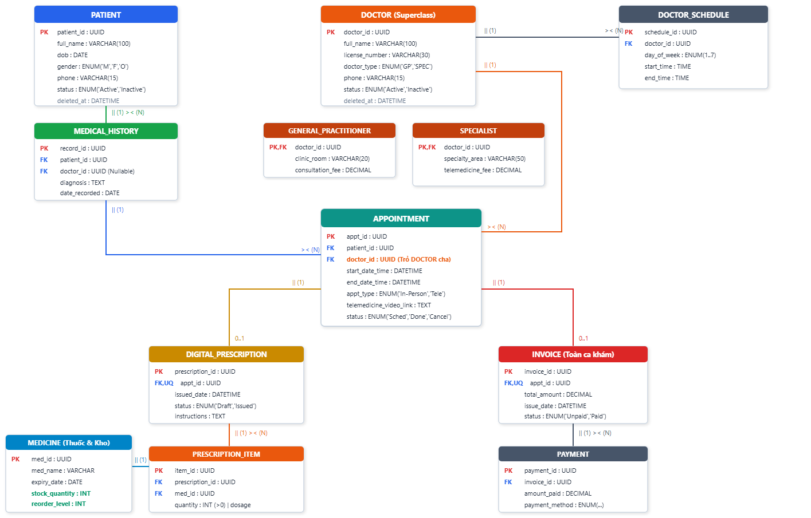

[physical_schema_diagram_EN.md](https://github.com/user-attachments/files/32012850/physical_schema_diagram_EN.md)

# Physical Relational Schema Specification Document
## Detailed Analysis of Architectural Diagram: `schema.png` (IE Crow's Foot Notation - ISO/IEC 19505)
### Topic 05: Healthcare Clinic & Telemedicine Management System | INT1313 Database Systems - PTIT
**Project:** Clinic Management System Integrated with Telemedicine Portal | **Team:** Pingo

---

## 1. Physical Schema Visualization

This engineering document provides an exhaustive, 100% complete specification of all tables, fields, data types, primary keys, foreign keys, unique constraints, and relational cardinalities illustrated in the industrial physical database schema below:


*Figure: Industrial Relational Physical Schema (IE Crow's Foot Notation - ISO/IEC 19505) - Topic 05*

---

## 2. Mermaid Relational Schema Source Code

The following executable Mermaid `erDiagram` faithfully reconstructs the physical architecture illustrated in `schema.png`, ready for rendering on GitHub, VS Code, Notion, Obsidian, and Mermaid Live Editor:

```mermaid
erDiagram
    %% --- Specialization Hierarchy (Option 8.4a) ---
    DOCTOR ||--|| GENERAL_PRACTITIONER : "is_a (1:1 PK=FK)"
    DOCTOR ||--|| SPECIALIST : "is_a (1:1 PK=FK)"

    %% --- Doctor Scheduling & Appointments ---
    DOCTOR ||--o{ DOCTOR_SCHEDULE : "has_shifts (1:N)"
    DOCTOR ||--o{ APPOINTMENT : "conducts (1:N)"

    %% --- Patient Consultations & History ---
    PATIENT ||--o{ MEDICAL_HISTORY : "records (1:N)"
    MEDICAL_HISTORY ||--o{ APPOINTMENT : "references (1:N)"

    %% --- Clinical Encounter to Prescription & Invoice ---
    APPOINTMENT ||--o| DIGITAL_PRESCRIPTION : "generates (1:0..1)"
    APPOINTMENT ||--o| INVOICE : "bills (1:0..1)"

    %% --- Digital Pharmacy Pipeline ---
    DIGITAL_PRESCRIPTION ||--|{ PRESCRIPTION_ITEM : "contains (1:N)"
    MEDICINE ||--o{ PRESCRIPTION_ITEM : "dispenses (1:N)"

    %% --- Fiscal Payment Settlement ---
    INVOICE ||--o{ PAYMENT : "settles (1:N)"

    %% ================= ENTITY DEFINITIONS =================

    PATIENT {
        uuid patient_id PK "Primary Key: Patient unique ID"
        varchar full_name "Patient full legal name"
        date dob "Date of birth (dob <= CURRENT_DATE)"
        enum gender "'M', 'F', 'O'"
        varchar phone "Official contact phone number (UQ)"
        enum status "'Active', 'Inactive'"
        datetime deleted_at "Soft-delete audit timestamp"
    }

    MEDICAL_HISTORY {
        uuid record_id PK "Primary Key: Medical record ID"
        uuid patient_id FK "Foreign Key -> PATIENT.patient_id"
        uuid doctor_id FK "Foreign Key -> DOCTOR.doctor_id (Nullable)"
        text diagnosis "Clinical diagnostic summary"
        date date_recorded "Record entry date"
    }

    DOCTOR {
        uuid doctor_id PK "Primary Key: Doctor ID (Superclass)"
        varchar full_name "Doctor full legal name"
        varchar license_number "Medical practice license number (UQ)"
        enum doctor_type "'GP', 'SPEC'"
        varchar phone "Contact phone number"
        enum status "'Active', 'Inactive'"
        datetime deleted_at "Soft-delete audit timestamp"
    }

    GENERAL_PRACTITIONER {
        uuid doctor_id PK,FK "Inherits DOCTOR.doctor_id (1:1)"
        varchar clinic_room "Assigned in-person consultation room"
        decimal consultation_fee "Standard consultation tariff (> 0)"
    }

    SPECIALIST {
        uuid doctor_id PK,FK "Inherits DOCTOR.doctor_id (1:1)"
        varchar specialty_area "Medical specialization area"
        decimal telemedicine_fee "Specialist / Teleconsultation fee (> 0)"
    }

    DOCTOR_SCHEDULE {
        uuid schedule_id PK "Primary Key: Shift schedule ID"
        uuid doctor_id FK "Foreign Key -> DOCTOR.doctor_id"
        enum day_of_week "Day of week (1..7: Sun..Sat)"
        time start_time "Shift start time"
        time end_time "Shift end time (end_time > start_time)"
    }

    APPOINTMENT {
        uuid appt_id PK "Primary Key: Appointment encounter ID"
        uuid patient_id FK "Foreign Key -> PATIENT.patient_id"
        uuid doctor_id FK "Foreign Key -> DOCTOR.doctor_id (Superclass)"
        datetime start_date_time "Appointment scheduled start"
        datetime end_date_time "Appointment scheduled end"
        enum appt_type "'In-Person', 'Tele'"
        text telemedicine_video_link "Secure encrypted consultation URL"
        enum status "'Sched', 'Done', 'Cancel'"
    }

    DIGITAL_PRESCRIPTION {
        uuid prescription_id PK "Primary Key: Digital prescription ID"
        uuid appt_id FK,UQ "Unique Foreign Key -> APPOINTMENT.appt_id"
        datetime issued_date "Prescription issue timestamp"
        enum status "'Draft', 'Issued'"
        text instructions "Clinical administration directions"
    }

    PRESCRIPTION_ITEM {
        uuid item_id PK "Primary Key: Prescription line item ID"
        uuid prescription_id FK "Foreign Key -> DIGITAL_PRESCRIPTION"
        uuid med_id FK "Foreign Key -> MEDICINE"
        int quantity "Dispensed quantity (quantity > 0)"
        string dosage "Dosage, route, and frequency guidelines"
    }

    MEDICINE {
        uuid med_id PK "Primary Key: Medication catalog ID"
        varchar med_name "Pharmaceutical / Trade name (UQ)"
        date expiry_date "Batch expiry date"
        int stock_quantity "Available real-time physical stock (>= 0)"
        int reorder_level "Automated replenishment threshold"
    }

    INVOICE {
        uuid invoice_id PK "Primary Key: Encounter bill ID"
        uuid appt_id FK,UQ "Unique Foreign Key -> APPOINTMENT.appt_id"
        decimal total_amount "Consolidated encounter total (>= 0)"
        datetime issue_date "Invoice generation timestamp"
        enum status "'Unpaid', 'Paid'"
    }

    PAYMENT {
        uuid payment_id PK "Primary Key: Payment transaction ID"
        uuid invoice_id FK "Foreign Key -> INVOICE.invoice_id"
        decimal amount_paid "Disbursed transaction amount (> 0)"
        enum payment_method "'Cash', 'Credit Card', 'Bank Transfer', 'Insurance'"
    }
```

---

## 3. Physical Tables Detailed Specification

The physical relational model depicted in `schema.png` comprises **12 relational tables** structured into 5 foundational enterprise healthcare subsystems:

### 3.1. Patient Management & Medical History (`PATIENT`, `MEDICAL_HISTORY`)

#### Table: `PATIENT`
Stores legal identification, demographic, and administrative records for both walk-in physical clinic patients and online telemedicine users:
- `patient_id` (UUID, PK): Surrogate primary key uniquely identifying the patient across all healthcare encounters.
- `full_name` (VARCHAR(100), NOT NULL): Full legal name of the patient.
- `dob` (DATE, NOT NULL): Date of birth (Enforced integrity constraint: `dob <= CURRENT_DATE`).
- `gender` (ENUM('M', 'F', 'O'), NOT NULL): Standardized medical biological sex / gender (`'M'`: Male, `'F'`: Female, `'O'`: Other).
- `phone` (VARCHAR(15), NOT NULL, UNIQUE): Verified contact phone number, serving as an alternate search key and destination for automated SMS/portal reminders.
- `status` (ENUM('Active', 'Inactive'), DEFAULT 'Active'): Operational lifecycle status of the patient profile.
- `deleted_at` (DATETIME, Nullable): Timestamp designated for the **Soft-Delete** pattern, ensuring strict regulatory compliance by archiving records without physical row removal.

#### Table: `MEDICAL_HISTORY`
Chronicles pre-existing conditions, past diagnoses, surgical interventions, and ongoing chronic therapies:
- `record_id` (UUID, PK): Surrogate primary key for the medical history entry.
- `patient_id` (UUID, FK, NOT NULL): Mandatory foreign key referencing `PATIENT(patient_id)`.
- `doctor_id` (UUID, FK, Nullable): Foreign key referencing `DOCTOR(doctor_id)` who diagnosed or recorded the condition (nullable if documented from historical external clinic documentation).
- `diagnosis` (TEXT, NOT NULL): Comprehensive clinical diagnosis, anamnesis, and diagnostic impressions.
- `date_recorded` (DATE, NOT NULL): Date the clinical record was officially logged in the system.

---

### 3.2. Doctor Specialization Hierarchy & Scheduling (`DOCTOR`, `GENERAL_PRACTITIONER`, `SPECIALIST`, `DOCTOR_SCHEDULE`)

The architecture models specialization using **Option 8.4a (Multiple Relations with 1:1 Identity Inheritance)** as defined in relational database theory (Elmasri & Navathe). The superclass stores shared attributes, while disjoint subclasses preserve role-specific properties linked by a unified primary key (`PK = FK`):

```
                      ┌────────────────────────────┐
                      │    DOCTOR (Superclass)     │
                      │    PK: doctor_id           │
                      └─────────────┬──────────────┘
                                    │
               ┌────────────────────┴────────────────────┐
               ▼ (1:1 PK=FK)                             ▼ (1:1 PK=FK)
┌──────────────────────────────┐          ┌──────────────────────────────┐
│     GENERAL_PRACTITIONER     │          │          SPECIALIST          │
│ PK,FK: doctor_id             │          │ PK,FK: doctor_id             │
│ clinic_room : VARCHAR(20)    │          │ specialty_area : VARCHAR(50) │
│ consultation_fee : DECIMAL   │          │ telemedicine_fee : DECIMAL   │
└──────────────────────────────┘          └──────────────────────────────┘
```

#### Table: `DOCTOR` (Superclass)
- `doctor_id` (UUID, PK): Surrogate primary key for physician identity.
- `full_name` (VARCHAR(100), NOT NULL): Doctor full legal name.
- `license_number` (VARCHAR(30), NOT NULL, UNIQUE): Official medical practitioner license number issued by the Ministry of Health.
- `doctor_type` (ENUM('GP', 'SPEC'), NOT NULL): Disjoint discriminator flag (`'GP'`: General Practitioner, `'SPEC'`: Medical Specialist).
- `phone` (VARCHAR(15), NOT NULL): Internal contact / emergency on-call telephone number.
- `status` (ENUM('Active', 'Inactive'), DEFAULT 'Active'): Physician employment / duty status.
- `deleted_at` (DATETIME, Nullable): Soft-delete audit timestamp upon contract termination or retirement.

#### Table: `GENERAL_PRACTITIONER` (Subclass)
- `doctor_id` (UUID, PK, FK): Simultaneously serves as the table Primary Key and Foreign Key referencing `DOCTOR(doctor_id)` with an exact 1:1 cardinality.
- `clinic_room` (VARCHAR(20), NOT NULL): Physical examination room designation within the outpatient clinic (e.g., *"Room 102"*, *"Suite B"*).
- `consultation_fee` (DECIMAL(10,2), NOT NULL): Standard in-person examination charge (Check constraint: `consultation_fee > 0`).

#### Table: `SPECIALIST` (Subclass)
- `doctor_id` (UUID, PK, FK): Simultaneously serves as the table Primary Key and Foreign Key referencing `DOCTOR(doctor_id)` with an exact 1:1 cardinality.
- `specialty_area` (VARCHAR(50), NOT NULL): Medical discipline domain (e.g., Cardiology, Dermatology, Neurology, Pediatrics).
- `telemedicine_fee` (DECIMAL(10,2), NOT NULL): Dedicated video teleconsultation / specialty assessment rate (Check constraint: `telemedicine_fee > 0`).

#### Table: `DOCTOR_SCHEDULE` (Shift Rostering)
- `schedule_id` (UUID, PK): Surrogate primary key for a roster shift.
- `doctor_id` (UUID, FK, NOT NULL): Foreign key referencing the physician `DOCTOR(doctor_id)`.
- `day_of_week` (ENUM(1..7), NOT NULL): Day of weekly recurrence (`1`: Sunday, `2`: Monday, ..., `7`: Saturday).
- `start_time` (TIME, NOT NULL): Shift commencement time.
- `end_time` (TIME, NOT NULL): Shift conclusion time (Check constraint: `end_time > start_time`).

---

### 3.3. Clinical Encounter Orchestration (`APPOINTMENT`)

The central coordination entity orchestrating patient-physician clinical workflows:

#### Table: `APPOINTMENT`
- `appt_id` (UUID, PK): Primary key uniquely identifying the clinical encounter.
- `patient_id` (UUID, FK, NOT NULL): Foreign key referencing `PATIENT(patient_id)`.
- `doctor_id` (UUID, FK, NOT NULL): Foreign key referencing the superclass `DOCTOR(doctor_id)` (explicitly highlighted as *"Points to DOCTOR superclass"* in `schema.png`), allowing both General Practitioners and Specialists to be booked seamlessly without polymorphic schema fragmentation.
- `start_date_time` (DATETIME, NOT NULL): Appointment scheduled commencement timestamp.
- `end_date_time` (DATETIME, NOT NULL): Appointment scheduled conclusion timestamp (Check constraint: `end_date_time > start_date_time`).
- `appt_type` (ENUM('In-Person', 'Tele'), NOT NULL): Modality of care delivery:
  - `'In-Person'`: Physical examination conducted within the clinic facility.
  - `'Tele'`: Synchronous video consultation via the telemedicine portal.
- `telemedicine_video_link` (TEXT, Nullable): Secure, end-to-end encrypted video consultation room URL (Mandatory when `appt_type = 'Tele'`).
- `status` (ENUM('Sched', 'Done', 'Cancel'), DEFAULT 'Sched'): Encounter finite state machine:
  - `'Sched'`: Confirmed future booking.
  - `'Done'`: Consultation completed and ready for billing/prescription release.
  - `'Cancel'`: Booking cancelled by patient or administrative staff.

---

### 3.4. Digital Pharmacy Pipeline & Inventory Management (`DIGITAL_PRESCRIPTION`, `PRESCRIPTION_ITEM`, `MEDICINE`)

#### Table: `DIGITAL_PRESCRIPTION` (Prescription Header)
- `prescription_id` (UUID, PK): Primary key for the digital prescription.
- `appt_id` (UUID, FK, UNIQUE, NOT NULL): Foreign key referencing `APPOINTMENT(appt_id)`. The `UNIQUE` constraint strictly enforces the business integrity rule: **Each clinical encounter can generate at most one digital prescription (1 : 0..1 cardinality)**.
- `issued_date` (DATETIME, NOT NULL): Date and time of clinical sign-off.
- `status` (ENUM('Draft', 'Issued'), DEFAULT 'Draft'):
  - `'Draft'`: Prescription under physician revision; line items can be added, updated, or removed.
  - `'Issued'`: Officially authorized and signed; the record becomes **immutable (Read-Only)** and triggers automated warehouse stock deduction.
- `instructions` (TEXT, Nullable): Comprehensive patient advice, dietary precautions, and clinical notes.

#### Table: `PRESCRIPTION_ITEM` (Prescription Line Items)
Associative entity resolving the Many-to-Many (M:N) relationship between `DIGITAL_PRESCRIPTION` and pharmaceutical inventory `MEDICINE`:
- `item_id` (UUID, PK): Primary key identifying the individual prescription line item.
- `prescription_id` (UUID, FK, NOT NULL): Foreign key referencing `DIGITAL_PRESCRIPTION(prescription_id)`.
- `med_id` (UUID, FK, NOT NULL): Foreign key referencing the pharmaceutical item in `MEDICINE(med_id)`.
- `quantity` (INT, NOT NULL): Quantity prescribed for fulfillment (Integrity check constraint: `quantity > 0`).
- `dosage` (VARCHAR(255), NOT NULL): Exact clinical dosage, frequency, and duration regimen (e.g., *"500mg, twice daily after meals for 7 days"*).

#### Table: `MEDICINE (Medication & Inventory)`
- `med_id` (UUID, PK): Primary key uniquely identifying the pharmaceutical item.
- `med_name` (VARCHAR(150), NOT NULL, UNIQUE): Standard generic pharmaceutical / trade brand name.
- `expiry_date` (DATE, NOT NULL): Lot batch expiration date (Enforced constraint: Dispensing expired medication where `expiry_date < CURRENT_DATE` is rejected).
- `stock_quantity` (INT, NOT NULL, DEFAULT 0): Real-time physical inventory available in the clinic dispensary (highlighted in cyan on `schema.png`). Check constraint: `stock_quantity >= 0`.
- `reorder_level` (INT, NOT NULL, DEFAULT 10): Minimum safety threshold triggering automated procurement notifications.

---

### 3.5. Fiscal Billing & Payment Settlements (`INVOICE`, `PAYMENT`)

#### Table: `INVOICE (Consolidated Encounter Bill)`
- `invoice_id` (UUID, PK): Primary key identifying the consolidated medical invoice.
- `appt_id` (UUID, FK, UNIQUE, NOT NULL): Foreign key referencing `APPOINTMENT(appt_id)`. The `UNIQUE` constraint enforces that **exactly one invoice is generated per clinical encounter (1 : 0..1 cardinality)**.
- `total_amount` (DECIMAL(12,2), NOT NULL): Total financial fee = Clinical consultation fee (`consultation_fee` or `telemedicine_fee`) + Cumulative cost of all dispensed medications from `PRESCRIPTION_ITEM`. Check constraint: `total_amount >= 0`.
- `issue_date` (DATETIME, NOT NULL): Timestamp when billing was finalized.
- `status` (ENUM('Unpaid', 'Paid'), DEFAULT 'Unpaid'): Fiscal settlement status.

#### Table: `PAYMENT` (Payment Transactions)
- `payment_id` (UUID, PK): Primary key identifying an individual fiscal transaction.
- `invoice_id` (UUID, FK, NOT NULL): Foreign key referencing `INVOICE(invoice_id)`. An invoice supports multiple installment transactions or split payment methods (`1 : N`).
- `amount_paid` (DECIMAL(12,2), NOT NULL): Disbursed transaction amount in this tranche (Check constraint: `amount_paid > 0`).
- `payment_method` (ENUM('Cash', 'Credit Card', 'Bank Transfer', 'Insurance'), NOT NULL): Authorized payment gateway / payment channel.

---

## 4. Relationship & Foreign Key Constraints Matrix

The table below synthesizes all relationships, foreign key mappings, and structural cardinalities portrayed in `schema.png`:

| Parent Table (1) | Child Table (N) | Foreign Key Column | Cardinality | Crow's Foot Notation | Business Logic & Integrity Constraints |
| :--- | :--- | :--- | :---: | :---: | :--- |
| `DOCTOR` | `GENERAL_PRACTITIONER` | `doctor_id` | 1 : 1 | `|| (1) — || (1)` | 1:1 Disjoint specialization inheritance (Option 8.4a). `doctor_id` is both PK and FK. |
| `DOCTOR` | `SPECIALIST` | `doctor_id` | 1 : 1 | `|| (1) — || (1)` | 1:1 Disjoint specialization inheritance (Option 8.4a). `doctor_id` is both PK and FK. |
| `DOCTOR` | `DOCTOR_SCHEDULE` | `doctor_id` | 1 : N | `|| (1) — o{ (N)` | 1 Doctor configures multiple recurring weekly shift schedules. |
| `DOCTOR` | `APPOINTMENT` | `doctor_id` *(Points to DOCTOR)* | 1 : N | `|| (1) — o{ (N)` | 1 Doctor handles multiple scheduled clinical consultations. |
| `PATIENT` | `MEDICAL_HISTORY` | `patient_id` | 1 : N | `|| (1) — o{ (N)` | 1 Patient owns multiple historical medical and clinical condition records. |
| `MEDICAL_HISTORY` | `APPOINTMENT` | `patient_id` / Cross-ref | 1 : N | `|| (1) — o{ (N)` | Patient historical records provide diagnostic context across multiple appointments. |
| `APPOINTMENT` | `DIGITAL_PRESCRIPTION` | `appt_id` *(FK, UQ)* | 1 : 0..1 | `|| (1) — o| (0..1)` | 1 Finished clinical encounter produces at most 1 unique digital prescription. |
| `APPOINTMENT` | `INVOICE` | `appt_id` *(FK, UQ)* | 1 : 0..1 | `|| (1) — o| (0..1)` | 1 Finished clinical encounter produces at most 1 consolidated financial invoice. |
| `DIGITAL_PRESCRIPTION`| `PRESCRIPTION_ITEM` | `prescription_id` | 1 : N | `|| (1) — |{ (N)` | 1 Digital prescription contains one or more prescribed medication line items. |
| `MEDICINE` | `PRESCRIPTION_ITEM` | `med_id` | 1 : N | `|| (1) — o{ (N)` | 1 Medication catalog entry can be dispensed across multiple prescription line items. |
| `INVOICE` | `PAYMENT` | `invoice_id` | 1 : N | `|| (1) — o{ (N)` | 1 Medical invoice may be settled through one or more partial payment transactions. |

---

## 5. Architectural Engineering Highlights

1. **Planar Zero-Crossing Visual Layout**:
   - The entity-relationship graph in `schema.png` is topologically optimized with zero intersecting lines. Clinical workflows flow logically from top to bottom and left to right, minimizing visual clutter for engineering and clinical audit reviews.
2. **Polymorphic Doctor Foreign Key Association (`APPOINTMENT.doctor_id -> DOCTOR`)**:
   - Instead of bifurcating foreign keys into `gp_id` and `specialist_id`, the `APPOINTMENT` table points directly to the `DOCTOR` superclass. This cleanly eliminates NULL pointer anomalies and polymorphic table joins while supporting both physical GP consultations and Telemedicine Specialist sessions.
3. **Strict 1:0..1 Relationship via Unique Foreign Keys (`FK, UQ`)**:
   - Both `DIGITAL_PRESCRIPTION.appt_id` and `INVOICE.appt_id` are declared as `UNIQUE` foreign keys. This architectural safeguard prevents duplicate billing and duplicate medication orders for any single clinical encounter at the database engine level.
4. **Real-time Inventory Depletion & Stock Integrity**:
   - The dispensary model integrates automated consistency checks: When `DIGITAL_PRESCRIPTION.status` transitions from `'Draft'` to `'Issued'`, an atomic database transaction verifies that `stock_quantity >= quantity` before decrementing stock, eliminating race conditions during high-volume dispensary operations.
5. **Regulatory Soft-Delete Implementation (`deleted_at`)**:
   - Tables `PATIENT` and `DOCTOR` incorporate nullable `deleted_at` timestamps. In compliance with medical record retention regulations (HIPAA and Ministry of Health standards), user deactivation never executes physical `DELETE` statements, preserving all historical audit trails.
6. **Full Third Normal Form (3NF) Compliance**:
   - Every non-key attribute is strictly non-transitively dependent on the primary key. Transitive dependencies (e.g., storing physician room numbers or specialty fees inside the `APPOINTMENT` record) are systematically decoupled into their respective specialized entities.
