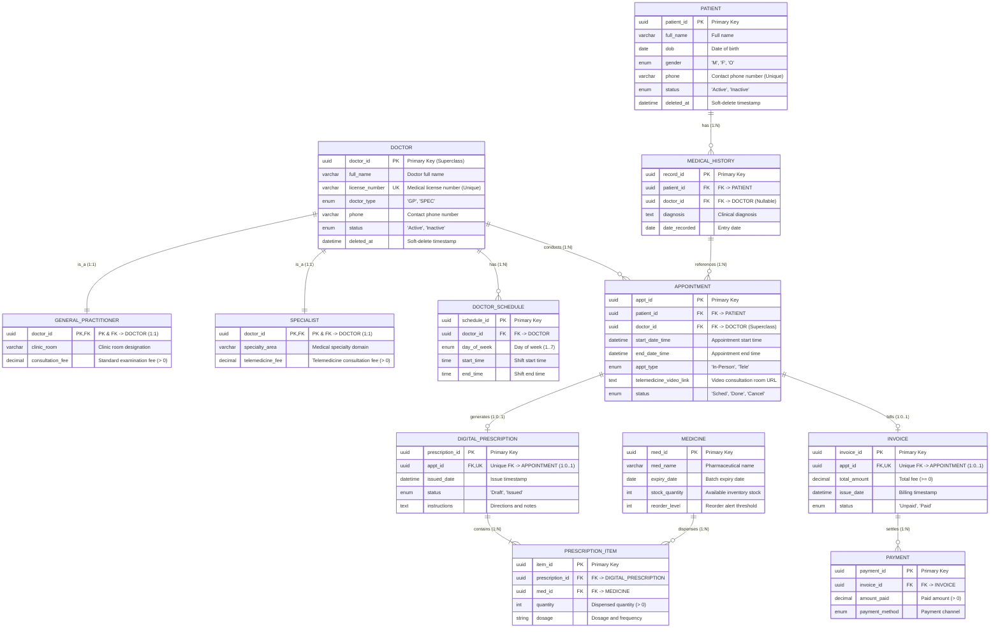

[physical_schema_diagram_EN.md](https://github.com/user-attachments/files/32013021/physical_schema_diagram_EN.md)
[physical_schema_diagram_EN.md](https://github.com/user-attachments/files/32013020/physical_schema_diagram_EN.md)# Physical Schema Diagram Documentation
## Analysis of Diagram: `schema.png` (IE Crow's Foot Notation)
### Topic 05: Healthcare Clinic & Telemedicine Management System | PTIT
**Project:** Clinic Management & Telemedicine Portal | **Team:** Pingo

---

## 1. Schema Visualization

This document explains the physical relational database schema shown in `schema.png`:

*Figure: Industrial Relational Physical Schema (IE Crow's Foot Notation) - Topic 05*

---

## 2. Mermaid ER Diagram

---

## 3. Physical Tables Specification

The schema contains **12 relational tables** corresponding directly to the entities in `schema.png`:

### 1. `PATIENT` (Patient Profile)
- `patient_id` (UUID, PK): Unique patient identifier.
- `full_name` (VARCHAR(100)): Full name of the patient.
- `dob` (DATE): Date of birth (`dob <= CURRENT_DATE`).
- `gender` (ENUM('M', 'F', 'O')): Biological sex.
- `phone` (VARCHAR(15), UNIQUE): Contact telephone number.
- `status` (ENUM('Active', 'Inactive')): Patient record status.
- `deleted_at` (DATETIME, Nullable): Timestamp for soft-delete.

### 2. `MEDICAL_HISTORY` (Clinical Records)
- `record_id` (UUID, PK): Medical history entry ID.
- `patient_id` (UUID, FK): References `PATIENT(patient_id)`.
- `doctor_id` (UUID, FK, Nullable): References `DOCTOR(doctor_id)` who diagnosed.
- `diagnosis` (TEXT): Clinical diagnosis details.
- `date_recorded` (DATE): Recording date.

### 3. `DOCTOR (Superclass)` (Physician Master)
- `doctor_id` (UUID, PK): Superclass primary key for physicians.
- `full_name` (VARCHAR(100)): Full name of the doctor.
- `license_number` (VARCHAR(30), UNIQUE): Medical practice license number.
- `doctor_type` (ENUM('GP', 'SPEC')): Physician role discriminator (`'GP'` or `'SPEC'`).
- `phone` (VARCHAR(15)): Official contact phone.
- `status` (ENUM('Active', 'Inactive')): Employment status.
- `deleted_at` (DATETIME, Nullable): Timestamp for soft-delete.

### 4. `GENERAL_PRACTITIONER` (Subclass)
- `doctor_id` (UUID, PK, FK): Inherits `DOCTOR(doctor_id)` via 1:1 identity mapping.
- `clinic_room` (VARCHAR(20)): Assigned in-person examination room.
- `consultation_fee` (DECIMAL): Standard clinic consultation fee (`> 0`).

### 5. `SPECIALIST` (Subclass)
- `doctor_id` (UUID, PK, FK): Inherits `DOCTOR(doctor_id)` via 1:1 identity mapping.
- `specialty_area` (VARCHAR(50)): Specialty field (Cardiology, Dermatology, etc.).
- `telemedicine_fee` (DECIMAL): Remote teleconsultation fee (`> 0`).

### 6. `DOCTOR_SCHEDULE` (Shift Rostering)
- `schedule_id` (UUID, PK): Schedule entry ID.
- `doctor_id` (UUID, FK): References `DOCTOR(doctor_id)`.
- `day_of_week` (ENUM(1..7)): Day of the week (`1` = Sunday, `2` = Monday, ..., `7` = Saturday).
- `start_time` (TIME): Shift starting time.
- `end_time` (TIME): Shift ending time (`end_time > start_time`).

### 7. `APPOINTMENT` (Consultation Encounters)
- `appt_id` (UUID, PK): Appointment encounter ID.
- `patient_id` (UUID, FK): References `PATIENT(patient_id)`.
- `doctor_id` (UUID, FK): References `DOCTOR(doctor_id)` superclass directly, supporting both GP and Specialist appointments.
- `start_date_time` (DATETIME): Scheduled start datetime.
- `end_date_time` (DATETIME): Scheduled end datetime.
- `appt_type` (ENUM('In-Person', 'Tele')): Consultation modality.
- `telemedicine_video_link` (TEXT, Nullable): Video meeting room URL (required when `appt_type = 'Tele'`).
- `status` (ENUM('Sched', 'Done', 'Cancel')): Appointment state.

### 8. `DIGITAL_PRESCRIPTION` (Prescription Header)
- `prescription_id` (UUID, PK): Prescription identifier.
- `appt_id` (UUID, FK, UNIQUE): Unique reference to `APPOINTMENT(appt_id)` ensuring a 1 : 0..1 relationship (maximum 1 prescription per appointment).
- `issued_date` (DATETIME): Issue timestamp.
- `status` (ENUM('Draft', 'Issued')): Prescription lifecycle status.
- `instructions` (TEXT, Nullable): Physician administration instructions.

### 9. `PRESCRIPTION_ITEM` (Prescription Details)
- `item_id` (UUID, PK): Line item identifier.
- `prescription_id` (UUID, FK): References `DIGITAL_PRESCRIPTION(prescription_id)`.
- `med_id` (UUID, FK): References `MEDICINE(med_id)`.
- `quantity` (INT): Prescribed quantity (`quantity > 0`).
- `dosage` (VARCHAR/STRING): Prescribed dosage instructions.

### 10. `MEDICINE (Thuốc & Kho)` (Catalog & Inventory)
- `med_id` (UUID, PK): Medicine identifier.
- `med_name` (VARCHAR): Pharmaceutical product name.
- `expiry_date` (DATE): Lot expiration date.
- `stock_quantity` (INT): Current inventory stock on hand (`>= 0`).
- `reorder_level` (INT): Minimum stock threshold for replenishment warning.

### 11. `INVOICE (Toàn ca khám)` (Billing Header)
- `invoice_id` (UUID, PK): Invoice identifier.
- `appt_id` (UUID, FK, UNIQUE): Unique reference to `APPOINTMENT(appt_id)` ensuring a 1 : 0..1 relationship (maximum 1 invoice per appointment).
- `total_amount` (DECIMAL): Consolidated bill amount (doctor fee + medication cost).
- `issue_date` (DATETIME): Billing timestamp.
- `status` (ENUM('Unpaid', 'Paid')): Payment settlement status.

### 12. `PAYMENT` (Payment Settlements)
- `payment_id` (UUID, PK): Payment transaction ID.
- `invoice_id` (UUID, FK): References `INVOICE(invoice_id)`.
- `amount_paid` (DECIMAL): Payment amount (`amount_paid > 0`).
- `payment_method` (ENUM(...)): Payment method (Cash, Card, Transfer, etc.).

---

## 4. Relationship & Constraints Matrix

The table below summarizes all 11 relationships displayed in `schema.png`:

| Parent Table (1) | Child Table (N / 0..1) | Foreign Key | Diagram Cardinality | Crow's Foot Symbol | Meaning |
| :--- | :--- | :--- | :---: | :---: | :--- |
| `DOCTOR` | `GENERAL_PRACTITIONER` | `doctor_id` | 1 : 1 | `|| (1) — || (1)` | 1:1 Specialization inheritance (`PK = FK`). |
| `DOCTOR` | `SPECIALIST` | `doctor_id` | 1 : 1 | `|| (1) — || (1)` | 1:1 Specialization inheritance (`PK = FK`). |
| `DOCTOR` | `DOCTOR_SCHEDULE` | `doctor_id` | 1 : N | `|| (1) — >< (N)` | 1 Doctor has multiple weekly shift schedules. |
| `DOCTOR` | `APPOINTMENT` | `doctor_id` *(Points to DOCTOR)* | 1 : N | `|| (1) — >< (N)` | 1 Doctor conducts multiple appointments. |
| `PATIENT` | `MEDICAL_HISTORY` | `patient_id` | 1 : N | `|| (1) — >< (N)` | 1 Patient has multiple medical history records. |
| `MEDICAL_HISTORY` | `APPOINTMENT` | `patient_id` / Cross-ref | 1 : N | `|| (1) — >< (N)` | Medical history informs multiple appointments. |
| `APPOINTMENT` | `DIGITAL_PRESCRIPTION` | `appt_id` *(FK, UQ)* | 1 : 0..1 | `|| (1) — 0..1` | 1 Appointment generates at most 1 prescription. |
| `APPOINTMENT` | `INVOICE` | `appt_id` *(FK, UQ)* | 1 : 0..1 | `|| (1) — 0..1` | 1 Appointment generates at most 1 invoice. |
| `DIGITAL_PRESCRIPTION` | `PRESCRIPTION_ITEM` | `prescription_id` | 1 : N | `|| (1) — >< (N)` | 1 Prescription contains multiple medication items. |
| `MEDICINE` | `PRESCRIPTION_ITEM` | `med_id` | 1 : N | `|| (1) — (N)` | 1 Medicine is dispensed across multiple prescriptions. |
| `INVOICE` | `PAYMENT` | `invoice_id` | 1 : N | `|| (1) — >< (N)` | 1 Invoice can be settled across multiple payments. |

---

## 5. Key Architecture Notes from Diagram

1. **Specialization Inheritance (Option 8.4a)**:
   - `DOCTOR` is the superclass. `GENERAL_PRACTITIONER` and `SPECIALIST` share the same primary key (`PK, FK doctor_id : UUID`), enforcing a 1:1 relationship with zero NULL attribute waste.
2. **Unified Doctor Foreign Key**:
   - `APPOINTMENT.doctor_id` points directly to `DOCTOR(doctor_id)` superclass (not separate tables), allowing both GP and Specialist appointments in a unified table.
3. **1 : 0..1 Constraint via Unique Foreign Key**:
   - `DIGITAL_PRESCRIPTION(appt_id)` and `INVOICE(appt_id)` are marked `FK, UQ` (or `FK, UK`), preventing multiple prescriptions or duplicate invoices per appointment.
4. **Inventory Management**:
   - `MEDICINE` tracks `stock_quantity` and `reorder_level` (highlighted green in diagram) for inventory control and reorder alerts.
5. **Regulatory Soft Delete**:
   - `PATIENT` and `DOCTOR` contain `deleted_at : DATETIME` to retain audit trails and medical history without physical row deletion.
