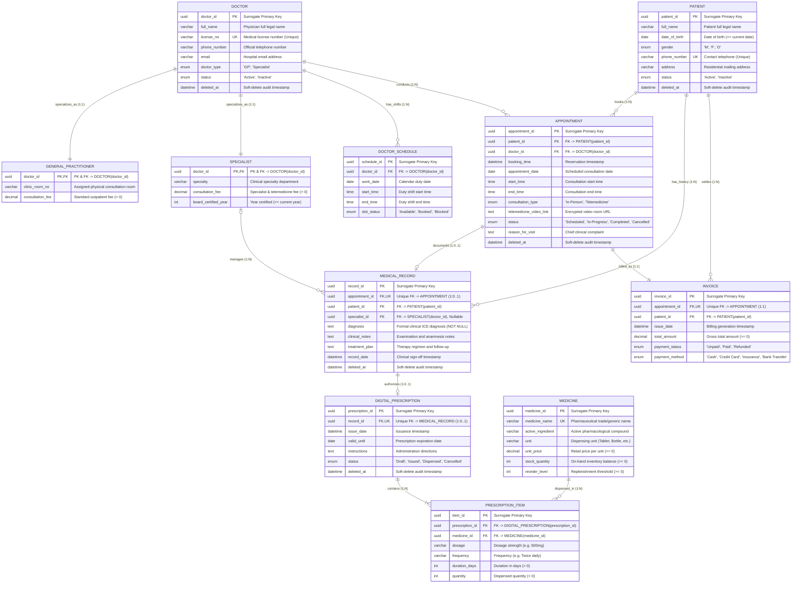

# Physical Schema Diagram Documentation
## Relational Schema Mapping (IE Crow's Foot Notation)
### Topic 05: Healthcare Clinic & Telemedicine Management System | PTIT
**Project:** Clinic Management & Telemedicine Portal | **Team:** G5 - Pingo  

---

## 1. Schema Visualization (Mermaid IE Crow's Foot)

This physical relational schema is mapped directly from the Phase 1 Enhanced Entity-Relationship (EER) model according to Elmasri-Navathe relational mapping principles:

---

## 2. Physical Relational Tables Specification

The schema contains **11 relational tables** mapped 1-to-1 from the conceptual EER model:

### 1. `DOCTOR` (Superclass Physician Master)
- `doctor_id` (UUID, PK): Primary surrogate identifier.
- `full_name` (VARCHAR(100)): Full legal practitioner name.
- `license_no` (VARCHAR(30), UNIQUE): Ministry of Health practicing license number.
- `phone_number` (VARCHAR(15)): Official contact telephone number.
- `email` (VARCHAR(100), Nullable): Professional clinic email address.
- `doctor_type` (ENUM('GP', 'Specialist')): Specialization discriminator enforcing disjoint EER hierarchy.
- `status` (ENUM('Active', 'Inactive')): Medical practitioner employment lifecycle state.
- `deleted_at` (DATETIME, Nullable): Non-destructive soft-delete audit timestamp.

### 2. `GENERAL_PRACTITIONER` (Subclass Option 8.4a)
- `doctor_id` (UUID, PK, FK): References `DOCTOR(doctor_id)` via 1:1 identity mapping.
- `clinic_room_no` (VARCHAR(20)): Assigned physical outpatient examination room.
- `consultation_fee` (DECIMAL(10,2)): Base outpatient physical examination charge (`> 0`).

### 3. `SPECIALIST` (Subclass Option 8.4a)
- `doctor_id` (UUID, PK, FK): References `DOCTOR(doctor_id)` via 1:1 identity mapping.
- `specialty` (VARCHAR(50)): Clinical specialty domain (Cardiology, Dermatology, etc.).
- `consultation_fee` (DECIMAL(10,2)): Specialist consultation rate (`> 0`).
- `board_certified_year` (INT): Year medical board certification was awarded (`<= current year`).

### 4. `DOCTOR_SCHEDULE` (Shift Rostering & Slots)
- `schedule_id` (UUID, PK): Surrogate identifier for duty shift.
- `doctor_id` (UUID, FK): References `DOCTOR(doctor_id)`.
- `work_date` (DATE): Specific calendar date of duty shift.
- `start_time` (TIME): Shift commencement time.
- `end_time` (TIME): Shift conclusion time (`end_time > start_time`).
- `slot_status` (ENUM('Available', 'Booked', 'Blocked')): Real-time booking state (BR-01, BR-02).

### 5. `PATIENT` (Patient Profile)
- `patient_id` (UUID, PK): Unique surrogate patient identifier.
- `full_name` (VARCHAR(100)): Full legal name.
- `date_of_birth` (DATE): Birth date (`date_of_birth <= CURRENT_DATE`).
- `gender` (ENUM('M', 'F', 'O')): Biological sex.
- `phone_number` (VARCHAR(15), UNIQUE): Contact telephone number.
- `address` (VARCHAR(255), Nullable): Residential mailing address.
- `status` (ENUM('Active', 'Inactive')): Registration status.
- `deleted_at` (DATETIME, Nullable): Soft-delete retention timestamp.

### 6. `APPOINTMENT` (Consultation Encounters)
- `appointment_id` (UUID, PK): Unique reservation token.
- `patient_id` (UUID, FK): References `PATIENT(patient_id)`.
- `doctor_id` (UUID, FK): References `DOCTOR(doctor_id)` superclass directly.
- `booking_time` (DATETIME): Reservation creation timestamp.
- `appointment_date` (DATE): Scheduled consultation date.
- `start_time` (TIME): Slot start time.
- `end_time` (TIME): Slot end time (`end_time > start_time`).
- `consultation_type` (ENUM('In-Person', 'Telemedicine')): Delivery modality.
- `telemedicine_video_link` (TEXT, Nullable): Encrypted video portal URL (mandatory when `consultation_type = 'Telemedicine'` upon moving to `In-Progress` per BR-05).
- `status` (ENUM('Scheduled', 'In-Progress', 'Completed', 'Cancelled')): Operational lifecycle state (BR-03).
- `reason_for_visit` (TEXT, Nullable): Patient chief complaint.
- `deleted_at` (DATETIME, Nullable): Soft-delete audit retention timestamp.

### 7. `MEDICAL_RECORD` (Clinical Diagnosis Ledger)
- `record_id` (UUID, PK): Diagnostic consultation record identifier.
- `appointment_id` (UUID, FK, UNIQUE): Unique reference to `APPOINTMENT(appointment_id)` enforcing 1:0..1 constraint (BR-06).
- `patient_id` (UUID, FK): References `PATIENT(patient_id)`.
- `specialist_id` (UUID, FK, Nullable): Optional attending specialist referencing `SPECIALIST(doctor_id)`.
- `diagnosis` (TEXT): Formal clinical diagnostic finding (`NOT NULL`).
- `clinical_notes` (TEXT, Nullable): Examination observations and anamnesis notes.
- `treatment_plan` (TEXT, Nullable): Therapy regimen and lifestyle recommendations.
- `record_date` (DATETIME): Clinical sign-off timestamp.
- `deleted_at` (DATETIME, Nullable): Soft-delete audit retention timestamp.

### 8. `DIGITAL_PRESCRIPTION` (Prescription Order Header)
- `prescription_id` (UUID, PK): Electronic prescription order identifier.
- `record_id` (UUID, FK, UNIQUE): Unique reference to `MEDICAL_RECORD(record_id)` enforcing 1:0..1 constraint (BR-07).
- `issue_date` (DATETIME): Issuance timestamp.
- `valid_until` (DATE): Expiration date (`valid_until >= issue_date`).
- `instructions` (TEXT, Nullable): General administration directions.
- `status` (ENUM('Draft', 'Issued', 'Dispensed', 'Cancelled')): Prescription lifecycle flag (BR-09, BR-10).
- `deleted_at` (DATETIME, Nullable): Soft-delete audit retention timestamp.

### 9. `PRESCRIPTION_ITEM` (Prescription Line Items)
- `item_id` (UUID, PK): Line item identifier.
- `prescription_id` (UUID, FK): References `DIGITAL_PRESCRIPTION(prescription_id)`.
- `medicine_id` (UUID, FK): References `MEDICINE(medicine_id)`.
- `dosage` (VARCHAR(50)): Prescribed intake dosage (e.g., '500mg').
- `frequency` (VARCHAR(50)): Frequency schedule (e.g., 'Twice daily').
- `duration_days` (INT): Duration in days (`duration_days > 0`).
- `quantity` (INT): Total dispensed units (`quantity > 0`).

### 10. `MEDICINE` (Dispensary Catalog & Stock)
- `medicine_id` (UUID, PK): Pharmaceutical catalog code.
- `medicine_name` (VARCHAR(100), UNIQUE): Proprietary or generic drug name.
- `active_ingredient` (VARCHAR(100), Nullable): Chemical active compound.
- `unit` (VARCHAR(20)): Dispensing unit (e.g., 'Tablet', 'Capsule', 'Vial').
- `unit_price` (DECIMAL(10,2)): Retail price per dispensing unit (`unit_price >= 0`).
- `stock_quantity` (INT): On-hand warehouse stock balance (`stock_quantity >= 0`).
- `reorder_level` (INT): Procurement reorder threshold (`reorder_level >= 0`).

### 11. `INVOICE` (Consolidated Encounter Billing)
- `invoice_id` (UUID, PK): Financial billing identifier.
- `appointment_id` (UUID, FK, UNIQUE): Unique reference to `APPOINTMENT(appointment_id)` enforcing 1:1 billing (BR-11).
- `patient_id` (UUID, FK): References billed `PATIENT(patient_id)`.
- `issue_date` (DATETIME): Billing timestamp.
- `total_amount` (DECIMAL(12,2)): Consolidated fee (`Consultation fee + Medication sum >= 0`).
- `payment_status` (ENUM('Unpaid', 'Paid', 'Refunded')): Settlement status (BR-12).
- `payment_method` (ENUM('Cash', 'Credit Card', 'Insurance', 'Bank Transfer')): Settlement channel.

---

## 3. Relational Foreign Key Integrity Matrix

| Parent Relation (1) | Child Relation (N / 1) | Foreign Key Attribute | Cardinality | Crow's Foot Symbol | Integrity Action (`ON DELETE`) |
| :--- | :--- | :--- | :---: | :---: | :--- |
| `DOCTOR` | `GENERAL_PRACTITIONER` | `doctor_id` | 1 : 1 | `|| (1) - || (1)` | `RESTRICT` (Mandatory inheritance) |
| `DOCTOR` | `SPECIALIST` | `doctor_id` | 1 : 1 | `|| (1) - || (1)` | `RESTRICT` (Mandatory inheritance) |
| `DOCTOR` | `DOCTOR_SCHEDULE` | `doctor_id` | 1 : N | `|| (1) - o{ (N)` | `CASCADE` (Duty shifts belong to doctor) |
| `DOCTOR` | `APPOINTMENT` | `doctor_id` | 1 : N | `|| (1) - o{ (N)` | `RESTRICT` (Audit protection) |
| `PATIENT` | `APPOINTMENT` | `patient_id` | 1 : N | `|| (1) - o{ (N)` | `RESTRICT` (Audit protection) |
| `APPOINTMENT` | `MEDICAL_RECORD` | `appointment_id` *(UQ)* | 1 : 0..1 | `|| (1) - o| (0..1)` | `RESTRICT` (Clinical records immutable) |
| `PATIENT` | `MEDICAL_RECORD` | `patient_id` | 1 : N | `|| (1) - o{ (N)` | `RESTRICT` (Clinical history preservation) |
| `SPECIALIST` | `MEDICAL_RECORD` | `specialist_id` | 1 : N | `o| (0..1) - o{ (N)`| `SET NULL` (Attending specialist optional) |
| `MEDICAL_RECORD` | `DIGITAL_PRESCRIPTION` | `record_id` *(UQ)* | 1 : 0..1 | `|| (1) - o| (0..1)` | `RESTRICT` (Prescription authorization bound to diagnosis) |
| `DIGITAL_PRESCRIPTION`| `PRESCRIPTION_ITEM` | `prescription_id` | 1 : N | `|| (1) - |{ (1..N)` | `CASCADE` (Line items belong to prescription) |
| `MEDICINE` | `PRESCRIPTION_ITEM` | `medicine_id` | 1 : N | `|| (1) - o{ (N)` | `RESTRICT` (Cannot delete dispensed medicines) |
| `APPOINTMENT` | `INVOICE` | `appointment_id` *(UQ)* | 1 : 1 | `|| (1) - || (1)` | `RESTRICT` (Fiscal audit protection) |
| `PATIENT` | `INVOICE` | `patient_id` | 1 : N | `|| (1) - o{ (N)` | `RESTRICT` (Financial ledger preservation) |

---

## 4. Key Architectural Alignment Notes

1. **Exact 1-to-1 Parity with Phase 1 EER**:
   - Zero attribute name mismatches between EER and Physical Schema.
   - `slot_status` and `work_date` preserved in `DOCTOR_SCHEDULE`.
   - `booking_time` and `consultation_type` preserved in `APPOINTMENT`.
   - Clinical diagnosis workflow maintained: `APPOINTMENT` → `MEDICAL_RECORD` → `DIGITAL_PRESCRIPTION` → `PRESCRIPTION_ITEM`.
2. **Specialization Mapping (Elmasri Step 8.4a)**:
   - Separate tables for `GENERAL_PRACTITIONER` and `SPECIALIST` sharing `doctor_id` as both PK and FK referencing `DOCTOR(doctor_id)`. Guarantees 100% normalization with zero NULL storage waste.
3. **Card-1:0..1 Constraints Enforced via Unique Foreign Keys**:
   - `MEDICAL_RECORD(appointment_id)`, `DIGITAL_PRESCRIPTION(record_id)`, and `INVOICE(appointment_id)` are declared with `UNIQUE` foreign keys, guaranteeing strict single-instance constraints.
